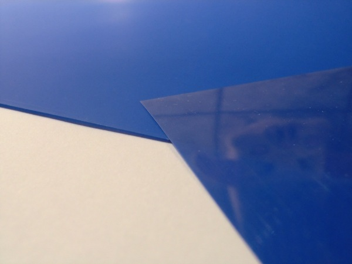

## The reason behind 
Yesterday i got my ordered press-n-peel foils! The reason why i want to try [press-n-peel](http://www.techniks.com/) foil is that i want to do my PCBs in our hackerspace with as less steps and costs as possible.
I've tried the [toner transfer method](http://www.dr-lex.be/hardware/tonertransfer.html) a few times but with lousy results. The toner seems to grip to the copper as well as to the paper, no matter what sort of paper i've tried. 
[Reichelt](http://reichelt.de) catalog pages, waxed paper, baking paper, etc. 
<!--more-->
The effort to rub the paper of while have the whole thing in sudsy water sucks as much as develop 
the PCBs photo resist in another chemical step. I know that there are a lot of people that have awsome results with the toner transfer method, but to me its to sophisticated. 

## Some facts
* I've ordered 10 sheets of foil on ebay for 14.50&euro; \+ 2&euro; shipping. 
* The sheet size is "Letter" (215,9mm x 279,4mm) and not A4 (210mm × 297mm) as ususal in europe. 
* That means a surface of 60322mm&#178;, enough for 3.77 Eurocard PCB board (160mm x 100mm).

## Look and feel
The foils are made of some kind of transparent flexible plastic foil and covered with some blue ink that seems not to grip on it very good.

 
Thats it for today, as soon as i made the first test i will post the results!
