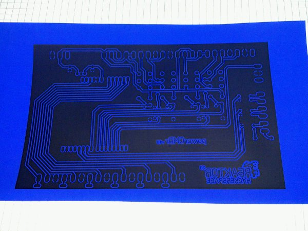
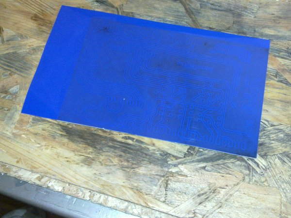
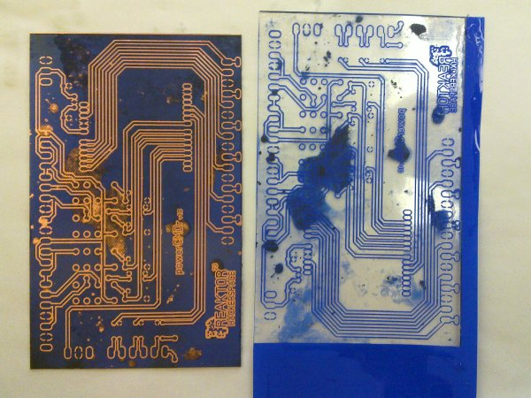
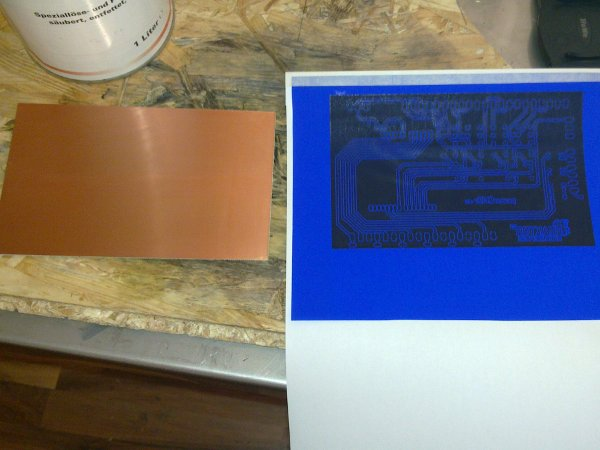
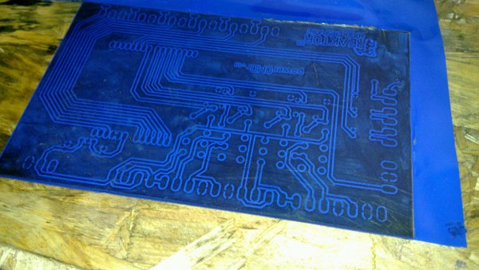
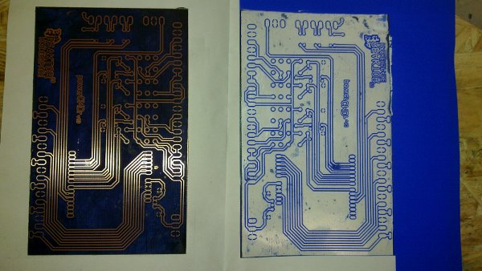
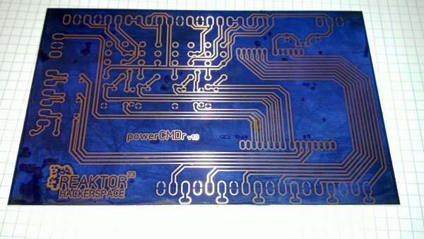
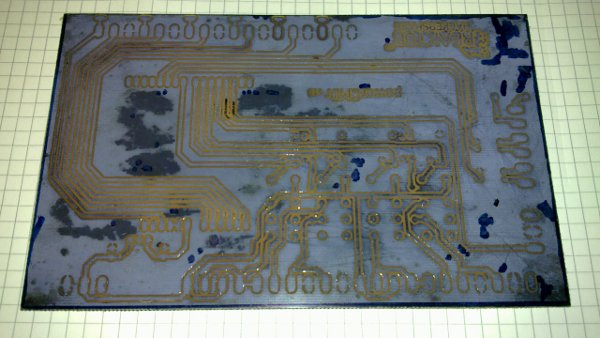
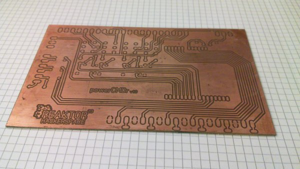

## The first test
Today i've made the first attempt to create a PCB with the press-n-peel foil.

This is the printed press-n-peel foil:

<!-- more -->

The foil pressed on the PCB:

And the lousy result after peeling the foil off:

As you can see the major part of the toner grips on the PCB, but rather large areas are just partially on the PCB.
Some of the toner even grips to the foil instead of the PCB. That sucks! I cleaned the board with aceton befor i started, but it seems useless.
After i examinated the board a little i noticed that one of my Hackerspace mates had a lot of fun abusing my board with a needle or something like that.
At two spots are little holes in the copper what looked like small craters. It seems that the iron hadn't enough contact there.

## Another attempt
This time i used a bit more expensive double layer copper board made by [Bungard](http://bungard.de/index.php?option=com_content&view=article&id=25&Itemid=76&lang=english), the king of PCB's in Germany.
I used just one side, but the (hopefully) better result will be the worth.

As you can see, i taped the left half of the foil to a normal sheet of paper to make it usable for the printer:

As i started to press the foil onto the board i noted, that the areas of the foil which are gripped well, looked much more dark than the rest. 
I ironed all areas as long as they had nearly the same colored. As you can see on the top edge i used a to high temparture for a short periode, and the foil melted:

After peeling off the foil, the result was absolutely great:

The few spots which were not covered correctly, were repaired with a permanent marker:

This is the etched result. After about 15 minutes in the ferric chloride i thought that something was wrong with the etchant, 
because i couldn't see that the copper was away. But i was wrong, the etchant worked well and fast, 
but the substrate was so dark that i didn't realized the color difference.
So the PCB is now a little "overetched":

This is the final result, after i cleaned it with aceton:

## Summary

The press-n-peel foils are defenitly much better than any paper!

### Positive

+ The effort is low
+ The handling is easy
+ Its fast
+ Its much more clean than paper and soapy water

### Neutral

+ The result seems to depending on the used printer (toner) and board material
+ The foils are sensitive and will get scratched easily

### Negative
+ The price is relatively high    
+ One foil can be used just one time, no matter how large the PCB is, except you do the sticky tape trick.
+ The "manual" gives no concrete instructions about the temprature to use

## Conclusion

I will use the foils in the future ecause im convinced of the result and handling.
