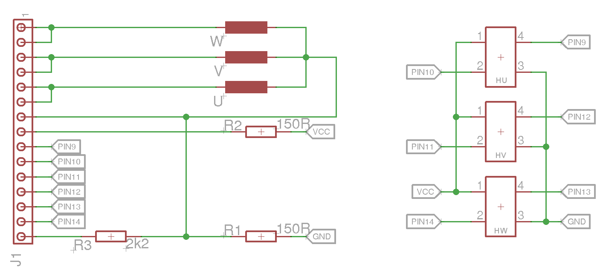

## The laser unit

A few days ago, i opened a broken laser printer to get its laser unit.
The printer was a Brother HL2030. I totally forgot to take pictures of the disassembling.

The picture shows the laser unit with already dismounted top cover, laser diode 
(the laser beam of a laser printer is invisible and extremely dangerous for the human eye!)
and controller PCB for the diode.

<!-- more -->

This is the areas the beam would normally cover. Its not very exact, more an assumption but to me it looks right.
The beam starts at the laser diode [A] on the left, goes through a lens [B] (i don't understand the function of this lens at the moment), 
then it hits the rotating mirror [C], which diffracts the beam. From here i marked the area the beam can hit in light green.
The beam goes through a concave lens [D] which spreads the range. Then it gets reflected by a mirror [E] and goes through another concave lense [F].
The last mirror is under the galvanometer. It diverts the beam to the paper.

But there is another three mirrors/lenses. The mirror [G] reflects the beam whenever it has crossed the whole concave lens. From there it goes
through a lens [H] which looks like the one [A] the beam passes at the start. Then it gets reflected by a mirror [I] again and hits finally a phototsensor [J].

This is the unmounted galvanometer. I did the mistake and tried to remove the lock ring, but after i was succeed, i realized that this ring just held the mirror on the rotating part of the motor.
The only thing i had to do to get the rotor off, was to turn the small white plastic hook. 

The disassembled galvo. Here you can see the white plastic hook i mentioned before.

I tried to get a schematic from the pcb to understand the functionality.

The schematic shows the 3 coils of the motor. There are 9 coils, 3 for each phase, but i can not see how they are connected together, so i drew just 1 for each phase.
The 3 little devices with 4 legs each, are the [Hall Sensors](http://en.wikipedia.org/wiki/Hall_effect). The driver needs them to measure the actual position of the rotor.

If i have time, I'll try to build a BLDC controller for this motor.
