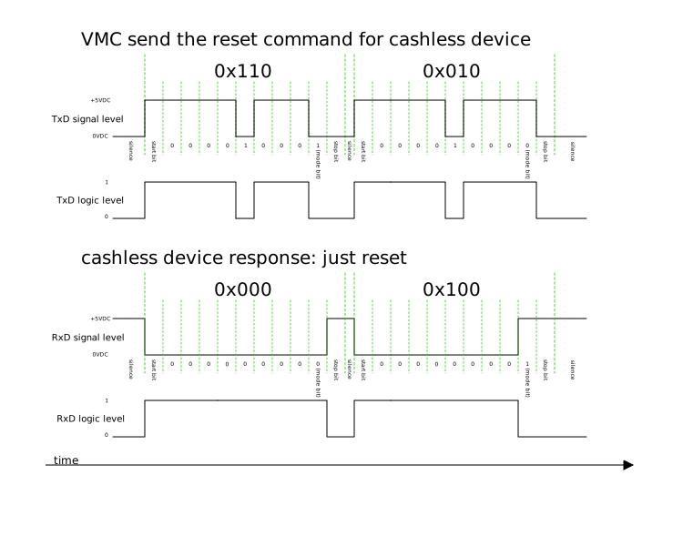

In 2010 I've bought a vending machine for our [hackerspace](https://reaktor23.org/de/projects/mate_dealer).
After we used it for a while with the built-in [coin changer device](http://www.nri.de/download/PDF_Englisch/Ersatz_G46F_GB.pdf), 
we noted that we need another way to pay the drinks.
So i decided to build a not yet defined type of cashless payment device. After a little research we found out that the 
machine controller communicates with the coin changer over the [MDB protocol](http://www.vending.org/technology/MDB_Version_4-2.pdf). 

<!-- more -->

## The basics

MDB is more or less a simple serial protocol. It works at 9600, 9, N, 1. That means 9600 Baud, 9 data bits, no parity bit, and one stopbit.
As you surely know, 9 data bits are not very common. The AtMega microcontrollers supports 9 bit natively, and this is why i use such a μC.
The VMC (**V**ending **M**achine **C**ontroller) is the master device. It's the only device that communicates actively with a device, 
all other devices just answer if they are addressed. On the bus is just one master, and many slaves. The number of slaves is limited by the address scheme.

## Hardware structure

Each peripheral device should be isolated from the bus with optocouplers.
This graphic shows how i've connected the cashless device to the vending machine.

## Signal levels

To me it was a bit confusing how the signal levels are, when i started to experiment with MDB. The idle level of the VMC TxD line is 0VDC, the RxD line whereas 5VDC.
That means that the TxD signal has to be inverted on the peripherial side since the idle level of a UART is high. This can be done using the optocoupler as an inverter.
The pull up resistor pulls the signal high, as long as the optocoupler isn't active.

## Device classes

+ VMC 
+ coin changer 
+ cashless devices
+ display
+ bill validator
+ many others ...

## Address scheme

The following graphic shows the address scheme for 3 different devices.

+ The modebit is just set if the VMC wants to address a device.
+ Each command for a specific device contains the address
+ The command is encoded in the least significant three bits

Lets takt the coin changer for example. This is how a few command would look like:

**I hope to continue this series as soon as possible.**

