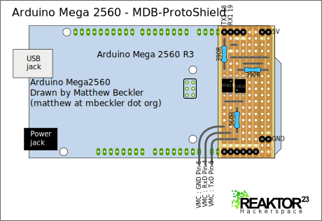

Today I want to show you how I connected our vending machine to the Arduino Mega 2560.
With a piece of stripboard i made a board that can be stacked on an Arduino like a real shield.

As you can see the board is really simple. It contain just 2 otocouplers to insulate the Arduino from the Vending machine controller, 2 resistors for the leds of each optocoupler and one as a pullup resistor.
The values of the resistors might be not perfect, but for me those values worked fine all the time. The optocpuplers are PC814 types. The can be exchanged with other types if you dont have theese available.
The board uses the UART1 for the communication. So I can use UART0 which is also used to program the Arduino to communicate with a PC. That has the nice effect that i can connect the Arduino with USB to the PC.

At the moment i work on finishing my code. As soon as i did that i will post another update with logic logs and a github link.

 
