 
Last Tuesday I’ve nearly finished the complete code for the MateDealer project. After I’ve successfully vended a Club Mate 
(that is the drink the [MateDealer](https://reaktor23.org/de/projects/mate_dealer) got it’s name from) I loged the MDB communication with my logic analyzer. 
I have taken a few screenshots of the logic trace and now i will try to explain the complete procedure.

<!-- more -->

## Checksum

First i will explain how the checksum is built, because the checksum is part of each sequence of transferred bytes.

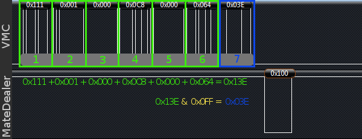

Here you see an example sequence of bytes (i'm not sure if byte is the correct term because they have 9 bits) received from the VMC. To validate the checksum, 
which is the last received byte, we simply add all bytes except the checksum itself.
The result in the example is `0x13E`, because it is greater than `0x0FF`, we have to cut off all bits greater than the 8th bit.
We can do this easily with a logic AND operation. The result of this AND operation is `0x03E`. As we see, this is equal to the received checksum and so it is valid.

Notice that the VMC checksums dont't have a set modebit, but the checksums of a slave have a set modebit.

## Reset 

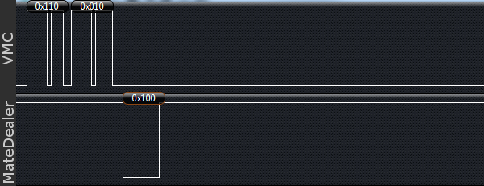

Here you see the RxD (labeled with MateDealer) and the TxD (labeled with VMC) line of the VMC. 
The first thing the VMC does after power up ist to ask for slaves on the bus. 
I've described the address scheme in an [earlier post](/blog/2012/05/06/the-mdb-protocol-part-1/).
On the screenshot you can see that the VMC sends `0x110` and `0x010`, which is the reset command for the first cashless device.
The first byte is the command itself, the second byte is the checksum. 
The MateDealer (which is a cashless device) answers the received reset command with an ACK which is represented by `0x100`. 

The state of the MateDealer is now **inactive**.

## Search for other slaves

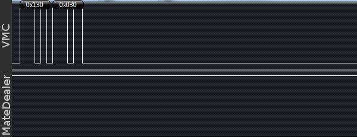

The VMC asks for a bill validator on the bus, but get no response. The VMC tries this 3 times on startup.
Later, the VMC will ask for a bill validator periodically, every few seconds. 

Same procedure for a coin acceptor. The VMC could do this for all kinds of MDB slaves, but our Sanden Vendo machine knows only theese 3 types.

## Poll

The VMC polls the cashless device cyclic with the poll command.
If the VMC polls a device, but the device has nothing to say or is not yet ready, it answers simply with ACK.
If we have to tell something to the VMC, we have to wait for a poll, because no slave sends data off his own bat. They just answer on a VMC command like a poll.

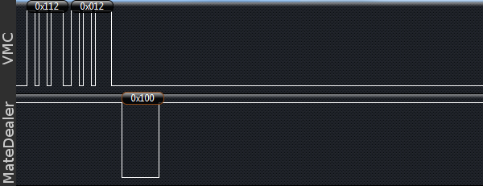

## Just reset

After we received the reset command, we answered with ACK directly, but that just means, that we received the command correctly.

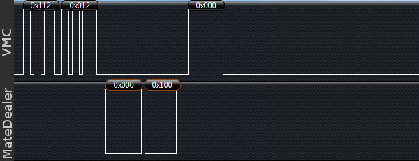

If we finished our reset procedure we answer the next poll with *just reset* which is `0x000 0x100`. Here the `0x000` is the reply and `0x100` is the checksum.
The VMC answers with ACK.

## Setup 

The setup consists of two "stages". The first is the *configuration data* stage, the second is *price data*.

### Stage 1
 
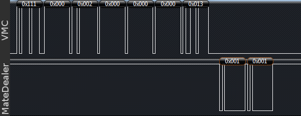
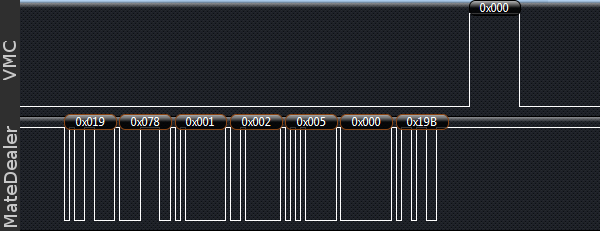

On the first screenshot you see the setup command `0x111`, followed by the subcommand *config data* represented by `0x000`.
The third byte is the *feature-level* of the VMC. Our's has feature-level 2.
Followd by 3 bytes of display information. Our VM has a display but it doesn't make it available to slave devices.
The bytes are *columns on display*, *rows on display* and *display info*. The last byte is the checksum again.

The MateDealer answers with its own configuration data. `0x001` stands for *reader config data*, `0x001` is the *feature-level* of the cashless device.
The sequence continues on the second screenshot with `0x019` and `0x078` which are the highbyte and lowbyte of the *country code*. Together they are `0x1987`, 
which is the *country code* for EURO. The next byte is the *scale factor*, we set it to 1, so 2300 EURO cents are read by the VMC as 23.00 EURO. 
Then we see a `0x002` for the *decimal places*, which also fits for EURO, and the *max response time* of `0x005` secondes. And, as expected, the checksum.

The VMC once more answers with ACK.

Now the VMC polls the Cashless device several times, we answer with ACK because we have nothing to say.

### Stage 2

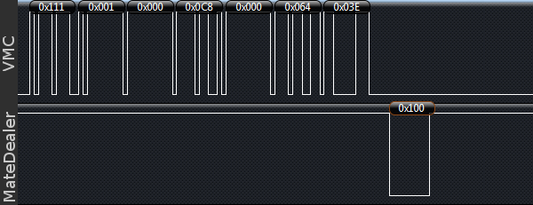

Here we see again the same command, namely setup followed by the subcommand *price data*.
The bytes 3 and 4 are the highbyte and lowbyte of the "max price", here `0x000 0x00C8`. Thats 200 in decimal notation and fits the highest price (2.00 EURO) we have set for a product in the VM.
The bytes 5 and 6 are the highbyte and lowbyte of the "min price", `0x000 0x064` (1.00 EURO). And last but not least the checksum.

Once again we answer with an ACK, and the state of the MateDealer changes to **disabled**.

## Reader

After we got polled a few times the VMC wants to enable the cashless device.

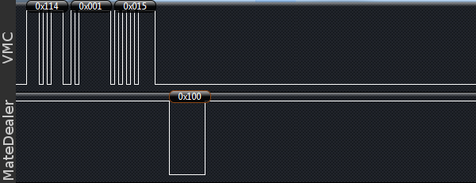

The command reader is `0x114`, the subcommand for enable is `0x001` and at the end the checksum.
And again we answer with an ACK, and the state of the MateDealer changes to **enabled**.

## Session start

Here begins the interesting part. We want the VMC to start a session. 

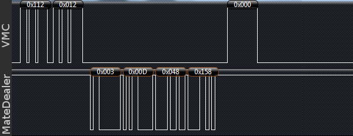

So we simply wait for an poll and answer with the `0x003` *start session* followed by `0x00D` and `0x048` which are 
the high and low bytes of the funds the session should start with. Here we start a session with 23.00 EURO. 
The last byte is as you expected the checksum and the VMC answers with ACK. 

The state of the MateDealer changes to **session idle**.

## Vend request

Now the VMC wait for the customer to choose a drink. As soon as he did, the VMC sends a *vend-request*.

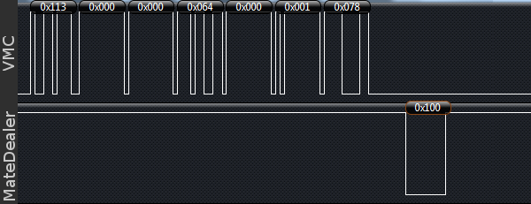

The VMC send the `0x113` vend command, followed by the `0x000` *vend request* subcommand, the product price `0x000` and `0x064` for high and low byte (1.00 EURO here) and the product number `0x000` and `0x001` again split in high and low byte for product 1.
And the checksum of course.

The state of the MateDealer changes to **vend**.

We answer with ACK.

## Vend approve

If the customer has enough funds available, we can approve the vend, otherwise we could deny it.

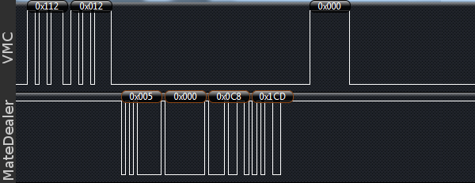

To do this we simply answer a poll from the vending machine with `0x005` *vend approved* and the vend amount in high byte `0x000` and low byte `0x0C8` followed by the checksum.

## Vend success

If the VMC vends the product successfully it confirms this with *vend success*.

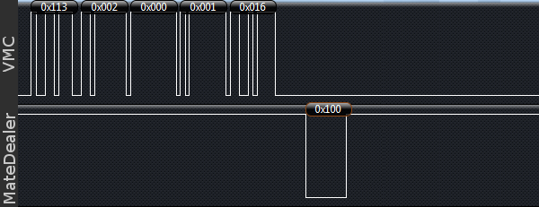

It sends the vend command `0x113`, the *vend success* subcommand `0x002`, the product numbers high byte `0x000` and low byte  `0x001` and the checksum.

We answer with ACK. 

The state of the MateDealer changes to **session idle**.

## Session cancel request

If i get the spec right, the VMC should send a *session complete* when the vend was successfull,
but i have seen that we just get polled.

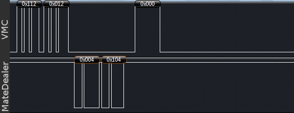

So i going to send a *session cancel request* when i want to terminate the session.
To do this i wait for a poll, and send the *session cancel request* `0x004` and the checksum.
The VMC answers with ACK.

I don't know if this is the right way to do so, but i have not yet found another way to terminate a session.

## Session complete

Now, the VMC terminates the session.

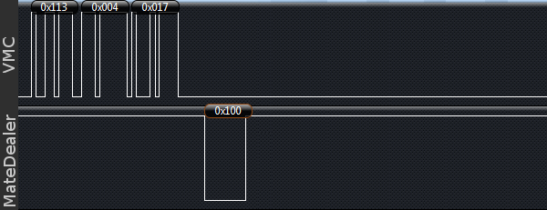

The VMC sends the vend command followed by the *session complete* subcommand `0x004` and the checksum.

We answer with ACK and the state changes to **enabled**.

## We're done

Thats a complete vending cycle on the MateDealer. I hope the screenshots and descriptions help you to understand MDB and/or 
to get your project to a working level.

