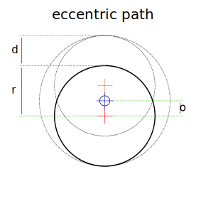

## The problem

I have built a PCB drill that works nice most of the time, but sometimes it occurs that the stepper motor don't perform a full turn.

This is caused by the friction of the eccentric tappet. I've simply made it out of a piece of steel rod, with a hole outside of its center.
That tappet pushes a brass screw upwards. I thought that this will work fine, but it does not (sometimes).

## The solution



That's my new eccentric tappet. It is a turned piece of metal rod, that has the eccentric hole (not yet done :-) ) and a ball bearing on it.
That will hopefully reduce the friction and solve my problem.

When i developed the new eccenter i searched for a formula to calculate the distance the eccenter will lift the drill upwards.

* red cross: marks the center of the circle before and after a half turn.
* blue cross: the center of the rotation
* grey dashed circle: the area the circle moves through on a full turn.

The formula is: ``distance [d] = offset [o] x 2``

**Update:**

I've installed and tested the new eccentric tappet and it seems to work better as the old one. But I have to drill a complete PCB without problems to confirm that.


