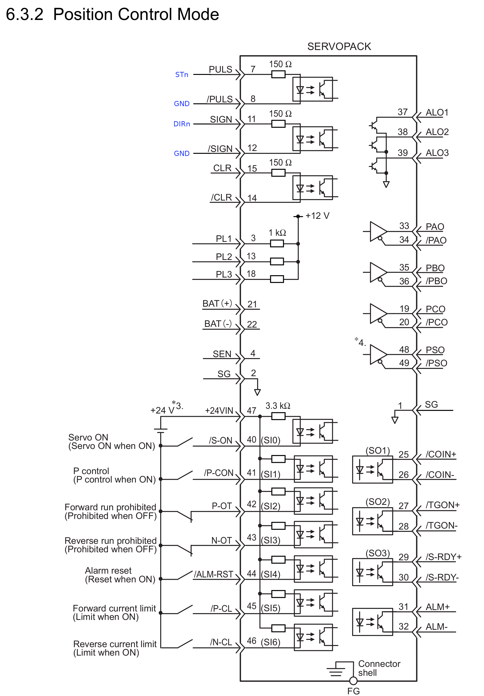

I posted a video on Youtube showing how I connected a [Smoothieboard](http://smoothieware.org/) wired to a [Yaskawa Sigma 2](https://www.yaskawa.com/pycprd/products/sigma5-servo-products/servopacks/sgdh) AC-Servodriver with a 400W Servomotor.
Afterwards I got asked to show more details and that's why I write this blog post.

<!--more-->

First of all, here's the video:
 


The Servodriver is a SGDH-04AE-OY which was originally sold by OMRON (thats why it has the OY at the end) but it is a Yaskawa product.
The motor is a SGMAH-04AAF41 which is a 400W, 3000rpm, 1.27Nm AC-Servomotor wthout holding brake.

Actually its pretty simple to wire the drive to the smoothieboard because its almost the same as wiring a large external stepper driver!
The mains wiring is straight forward to the manual, L1,L1C are wired to live, L2, L2C to neutral.

Here is a schematic showing how I wired the drive (CN1 connector) to the Smoothieboard:

The only signals I wired for my quick test were the STn to PULS and DIRn to SIGN. Those are wired to a 4x1 pin header next to each of the A4982 internal stepper drivers.
Because the signal level of the smoothieboard is only 3.3V you don't need any resistor for the optocouplers (the have 150Ohms built-in which results in 12mA current through the photodiode).
And the GND pin is connected to both, /PULS and /SIGN.

What I've not tested so far is the enable signal, because that would require a 24VDC signal between pin 47 and 40 (Servo-ON). I just changed a parameter so that the Servo enables itself after power up.
In a next test I will try to test that as well. 

The parameters are factory default with just a few changes:

- **Pn000 = 0x0010**
    - set the *Control Mode* to *1: Position (Pulse)*
- **Pn50A = 0x8170** 
    - set the *Run Signal Input Terminal Allocation* to *7:Always enabled*
    - set the *POT Signal Input Terminal Allocation* to *8:Always disabled*
- **Pn50B = 0x6548** 
    - set the *NOT Signal Input Terminal Allocation* to *8:Always disabled*

That's it, with theese settings i was able to drive the servo with the smoothieboard. For sure there is a lot of fine tuning necessary to make the positioning faster but thats another story :-)
