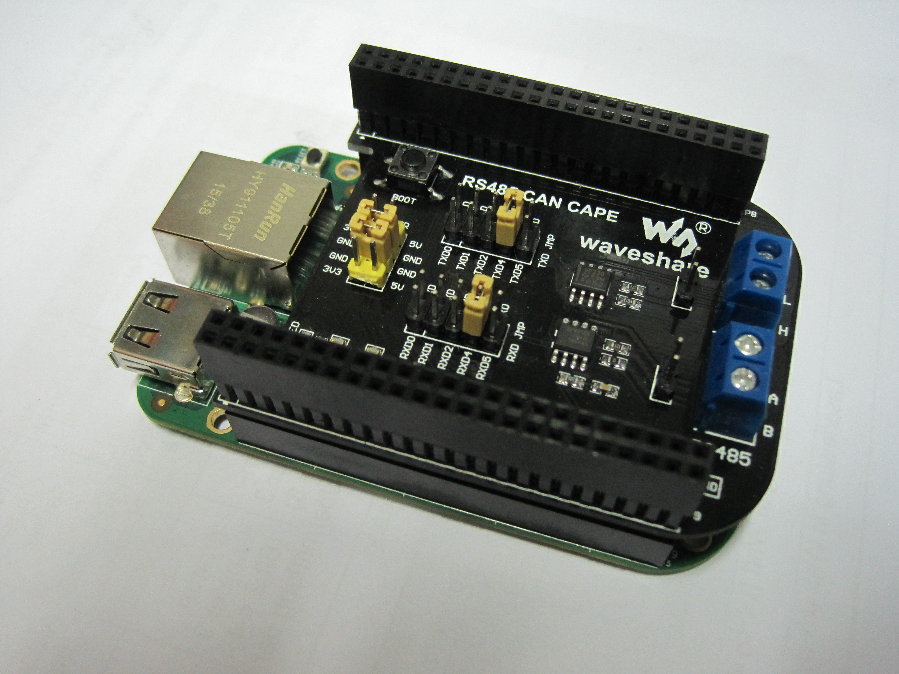

I want to build a Modbus TCP to Modbus RTU gateway using a [BeagleBoneGreen](http://beagleboard.org/Green) and a [WaveShare RS485 CAN CAPE](http://www.waveshare.com/rs485-can-cape.htm).
Unfortunately the [documentation](http://www.waveshare.com/wiki/RS485_CAN_CAPE#RS485_CAN_CAPE) on the Waveshare Cape is really bad, so I will try to document here what steps were necessary to get the things up and running!

<!--more-->



## The hardware part

First of all, RS485 is slightly different from lets say RS232 because it is Half Duplex. That means that you can not send and receive at the same time.
The physical connection between two bus devices is made by two differential wires. In order to be able to either receive or send, you need to tell the RS485 driver to switch between these modes (some drivers have auto sensing, but the one used on the Waveshare cape don't have this feature).

And here begins the trouble. The and [documentation](http://www.waveshare.com/wiki/RS485_CAN_CAPE#RS485_CAN_CAPE) and the [diagram](http://www.waveshare.com/rs485-can-cape.htm) on the product page only mention a so called "RS485 transceiver enable jumper" that gives you the choice between either receive or send mode.
Nowhere is documented that an GPIO pin is wired to the <span style="text-decoration: overline">RE</span>/DE pins of the driver IC, except on this [schematic](http://copperhilltech.com/content/RS485_CAN_Schematic.pdf) I've found after a long search.

In the first place I wired a GPIO Pin to the RSE header using a jumper wire and after that worked I soldered a wire in, just to see at a second closer look in the schematic that there is already a not documented connection in place! (ironically the same GPIO pin I connected :-) )

In the [schematic](http://copperhilltech.com/content/RS485_CAN_Schematic.pdf) you can see that header P9 Pin 42 is connected via an 0R resistor to the RSE signal. The RSE signal is connected to <span style="text-decoration: overline">RE</span> and DE. According to this [document](http://elinux.org/images/3/33/GPIO_Programming_on_the_Beaglebone.pdf) P9 pin 42 is `GPIO7`.

## The software part

My knowledge of the inner working of linux is unfortunately very limited, but anyway I need to get this thing to work.

So I read a lot of post in online forums and the most posts indicated that there is no support for RS485 in the kernel and manually patching and building a kernel ist necessary, but that information is old and NOT TRUE!

As of kernel 3.8.13-bone39 a [patch from Michael Musset](https://github.com/RobertCNelson/bb-kernel/blob/am33x-v3.8/patches/fixes/0007-omap-RS485-support-by-Michael-Musset.patch) enables the use of a GPIO pin for switching sending and receiving. Thank you so much Michael!

A lot of places suggested to use UART4 and I thought it might be a good idea to do so because I had no idea if another UART would work as well. So I set the jumpers to UART4, for both RX and TX.
But UART4 is not active by default and I had to activate it by editing `/boot/uEnv.txt`:

```sh
cape_enable=capemgr.enable_partno=BB-UART4
```

Thankfully I stumbled upon the very nice and detailed blog post of [logicsupply](http://inspire.logicsupply.com/2014/09/beaglebone-rs-485-communication.html). They sell their own RS485 cape, but unfortunately I already had the waveshare cape and wanted to stay with it.

But the hardware doesn't matter so much, and so I made use of their code and modified it slightly for my purposes:

```python
import serial, fcntl, struct

s = serial.Serial(
    port='/dev/ttyO4',
    baudrate=19200,
    parity=serial.PARITY_EVEN,
    stopbits=serial.STOPBITS_ONE,
    bytesize=serial.EIGHTBITS
)

# -- Begin of setup procedure --
# Standard Linux RS485 ioctl:
TIOCSRS485 = 0x542F

RS485_FLAGS = 0x21 # enable RS485 and use GPIO for RE/DE control

RS485_GPIO_PIN = 7

# Pack the config into 8 consecutive unsigned 32-bit values:
serial_rs485 = struct.pack('IIIIIIII',
                           RS485_FLAGS,        # config flags
                           0,                  # delay in us before send
                           0,                  # delay in us after send
                           RS485_GPIO_PIN,     # the pin number used for DE/RE
                           0, 0, 0, 0          # padding - space for more values
                           )

# Apply the ioctl to the open ttyO4 file descriptor:
fd=s.fileno()
fcntl.ioctl(fd, TIOCSRS485, serial_rs485)
# -- End of setup procedure --

# send a simple message
s.write("Hello, world!")

# print all data coming back
while True:
    if s.inWaiting():
        print(s.read())

# will never be reached
s.close()
```

The part marked with begin and end of setup procedure need only to be executed one time, after that you can simply write/read to/from the serial device and everything works fine!

I will use the BBG + Cape to build my own Mdobus TCP to Modbus RTU gateway. The reason is that I have a central ventilation system in my house that has only Modbus RTU. I want control it via my home automation system that only has Modbus TCP (I could buy a Modbus RTU extension, but the charge 150€ for that, which is a lot of money).

As soon as I have first results, I will write up another blog post with details.
