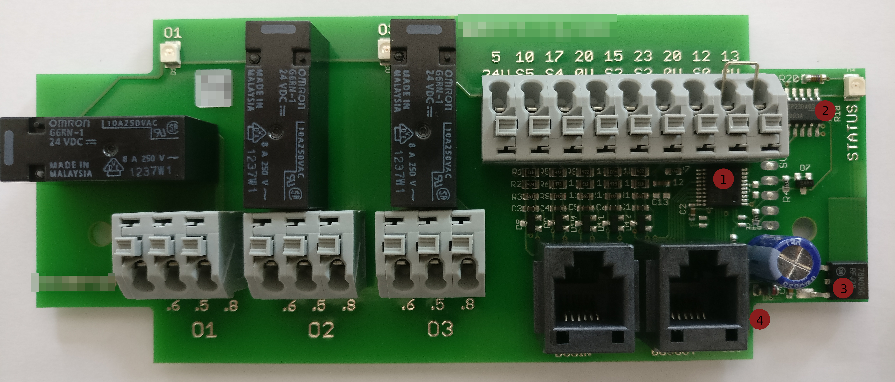
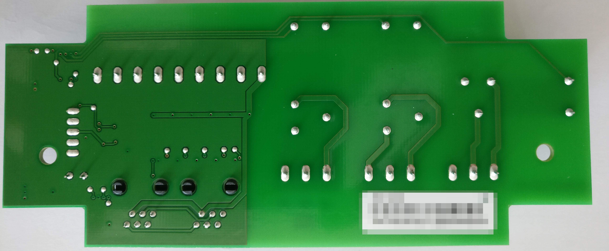
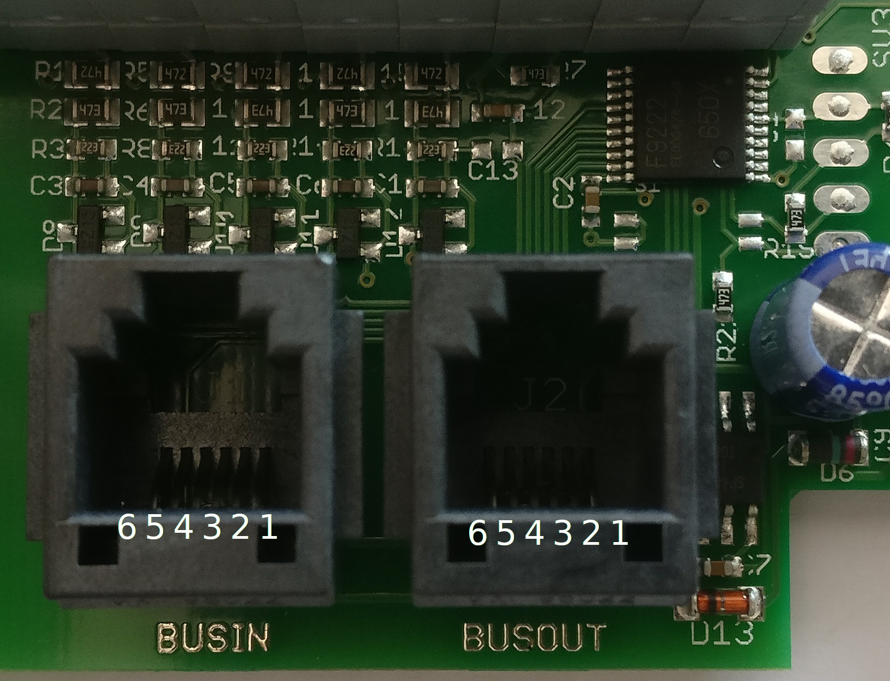
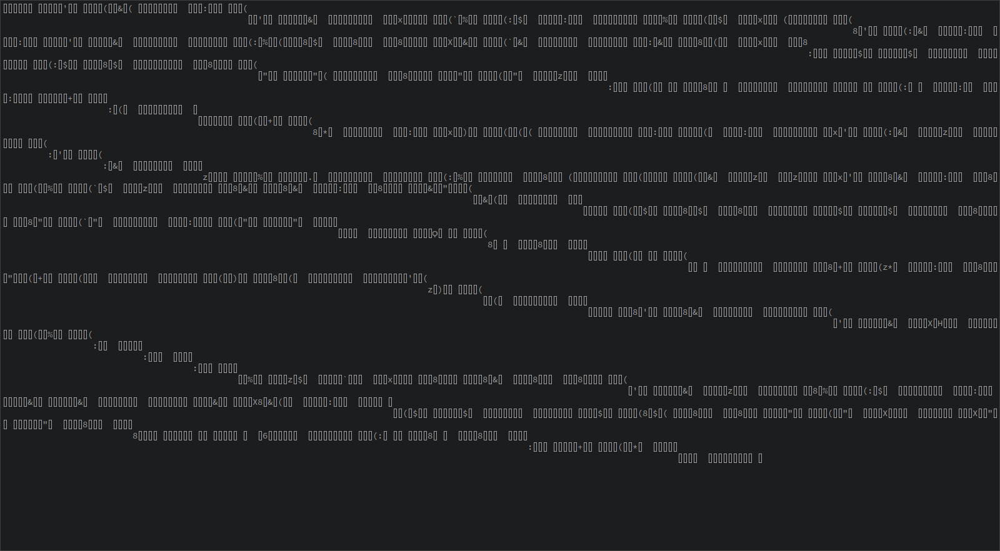
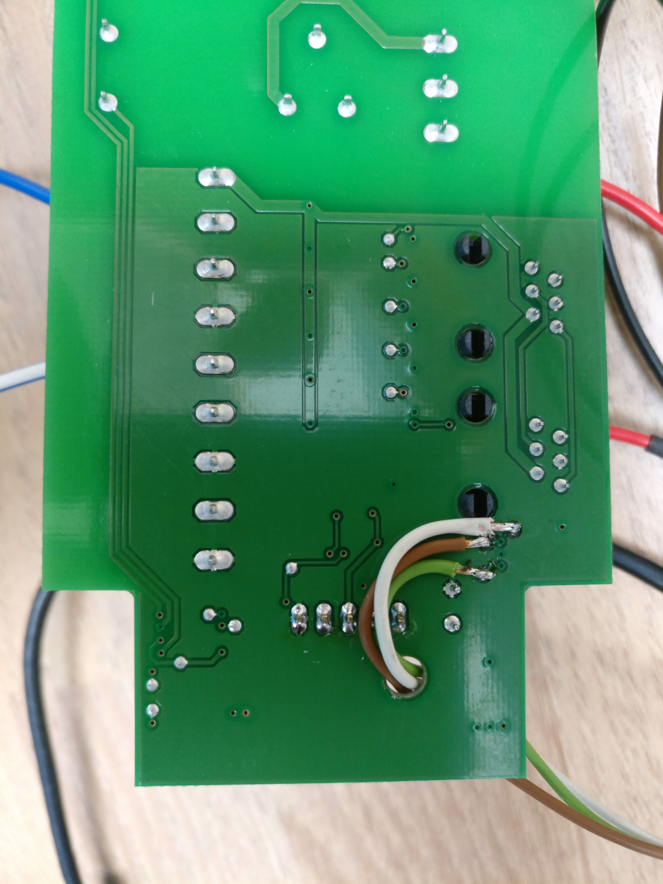
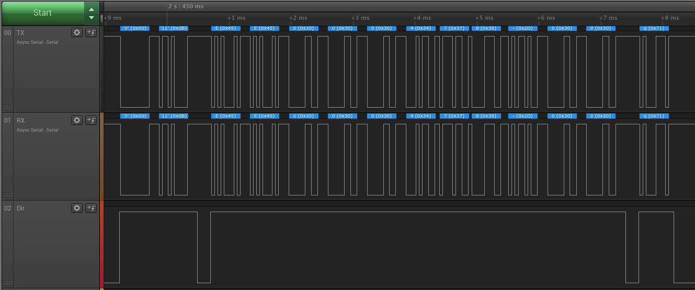
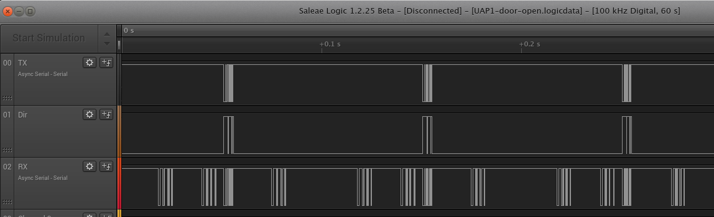
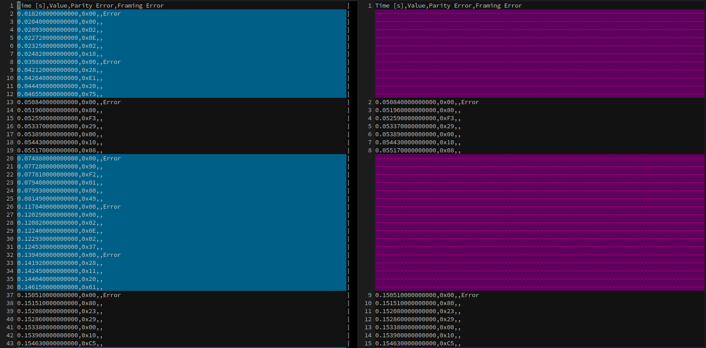

I own a Hörmann sectional door to my garage which is driven by a Hörmann SupraMatic E. 
To control the door via a home automation system you have several options:

 - Connect potential free contacts directly to the motor. That means you have just very basic control over the motor because you can't give up and down command but just a go command as you can with the radio controls.    
 - Usa a UAP1, a small extension box to have better control over the motor and get some feedback signals. Costs are about 50€ for the UAP1 and still a couple of potential free contacts are needed to connect the UAP1 to the home automation system. 
 - Speak directly to the motor and get the signals directly onto the homeautomation system. Exactly what I want to have :-)

I searched the internet for information about the bus, but little to nothing can be found about it. So I decided to reverse engeneer and document the bus!

# Hardware
Top side of the circuit board:

 1. The micro controller, a 20-pin SSOP, labled with F9222. After a while I found out  that it must be a Renesas μPD78F9222 8-bit micro controller ([datasheet](U16898EJ6V0UD00.pdf)).
 2. A Darlington Transistor Array, a 16-pin SOT, labled with ULN2003A. Drives at least the three relais, maybe more.
 3. The power supply, a D-PAK, labled with 78M05G. Converts the 24VDC coming from the motor down to 5VDC.
 4. A RS485 transceiver, a 8-pin SOT, labled with SP485EE. 

Bottom side of the circuit board:

Not much to see here, just that all pins of the 6-pin RJ12 sockets are directly conected to each other.

Pinout:

 1. Not clear
 2. 24VDC
 3. GND
 4. Not clear
 5. RS485, DATA-
 6. RS485, DATA+

I use a ExSys USB to RS422/RS485 converter I had lying around which a connected to the BUSOUT connector using a cable I made specifically for
 that purpose.

# Reverse engeneering the protocoll

I expected a rather simple protocoll where no comunication happens until the UAP1 gets triggered by a switch, but I was more than wrong.
Here's what I got using the USB converter with the door closed idling:

At first I thought I had a wrong baudrate but after a while I saw that at powerup the UAP1 sends the string "EE000478-00" before the gibberish starts.
That occured at **19200** baud (8N1) so I think that must be the correct baudrate.

Then I encountered another problem I didn't think about in the first place. RS485 is Half-Duplex, that means that only one participant on the bus can talk at a given time.
But how can I tell who is sending which bytes!?

I had to go to the other side of the RS485 converter IC which is connected to the UART of the μPD78F9222 and one pin that enables the transmitter.
Whith that one I can tell when the UAP1 is sending and when it is receiving!
But connecting a SOT IC to the Logic analyzer is no fun, so I decided to solder three wires to the bottom of the PCB where the three signals I need are luckily connected to vias.

I also soldered a pin header to the 5 solderpads next to the μPD78F9222. I hoped to find the signals there as well but it turned out that is not the case. But at least I can connect to GND there. I decided to look at the boards communications without the motor 
connected. To supply the board with 24VDC, which normally comes in via the RJ12 connector, I simply used the terminals taht normally connect the switches.

My setup:

- White: TX
- Brown: TX enable
- Green: RX

When the board is powered while the logic analyzer is collecting data, we see these bytes comming in:

Thats `0x00 0x0B` followed by the ASCII "EE000478-00" and terminated by `0x71`.
At that point I realized that "EE000478-00" is printed to the PCB, so its kind of a model or serial number.
Unfortunately no other communication is happening when I trigger a "close door" for example.
It seems that this must happen when the UAP1 is connected to the motor.

Later I captured traces using my logic analyzer for each possible command, these are:

- startup (not a real command but maybe interesting)
- open door
- close door
- ventilation position
- toggle lamp
- Radio door open
- Radio door close

This is what I got:

I've set two analyzers for async serial data on both, the RX and the 
TX line. They make me able to export the analyzed data as CSV.

The RX line still contains the sent bytes of the UAP1, so I wrote a 
python Script that annotates the RX file with RX and TX labels.

<strike>** This is how far i got until now. I'll try to extend this artcle or write a followup in the future. **</strike>

**Update: 2018-12-18**
# Decoding the Messages

Someone from Italy contacted me after reading this article and 
pointed out to me that I might find helpful Information on the Hörmann 
protocoll in one of their numerous patents, and indeed they were ver 
helpful!

- <a href="https://patents.google.com/patent/WO2005076529A1/en">https://patents.google.com/patent/WO2005076529A1/en</a>
- <a href="https://patents.google.com/patent/US20130159573/en">https://patents.google.com/patent/US20130159573/en</a>

The description in the patents is not cristal clear (at least to me) 
but still extremely helpful in figureing out whats going on on the bus.

A message is always formed like this:

`0x8D 0x32 0x01 0x80 0xBC`

- The first byte `0x8D` is the address of the device this message is for
- The second byte `0x02` is a combination of of a counter and a length.

- `0x32 >> 4 = 0x03` The counter is 3, it can only go as high a `0x0F` and then flips over and begins at 0 again
- `0x32 & 0x0F = 0x02` This is the length of what I call the body of the message and means that two more bytes will follow

- The body consists of `0x01 0x80`, I'll come back to the meaning of the messages later
- The last byte `0xBC` is a CRC8 checksum.

# The CRC checksum

After being able to seperate the byte stream into messages, I still 
wasn't able to calculate the checksum. No common CRC8 generator gave me 
the same result as the messages have.
I tried some CRC brute force attempts but without success. After having 
discussed that issue with my Italian friend he was able to figure out 
the polynom `0x07` as well as the initial value `0xF3` for the CRC algorithm.

I used the CRC calculator at <a href="http://blog.bouni.de/2018/sunshine2k.de">http://www.sunshine2k.de/coding/javascript/crc/crc_js.html</a>
 to verify the poly and init values. 
Fortunately the page gives you a nice lookup table for the CRC values 
which I then used in my Python program to verify all the messages I've 
recorded so far.

# Address Ranges

The patent gives a list of adresses for certain device categories:

- **0**:       Broadcast
- **1-15**:    Reserved
- **16-45**:   Intelligent contol panels
- **46-47**:   Not specified in the patent
- **48-79**:   Dynamically assigned by the master
- **80-100**:  Not specified in the patent
- **101-109**: Slave drives
- **110-127**: Reserved
- **128**:     Master drive
- **129-143**: Intelligent controllers
- **144**:     Diagnostic device / PC
- **145-256**: Reserved

# Messages

These are the messages I was able to make sense of so far. I might misinterprete some of them at this point :-)
As I've described the message format above, I'll only describe the body for the commands.
## Bus scan

At startup the Master scans the bus for devices. In my case it starts at address `0x8D` which is `141` in decimal.
It decrements this address and scans the entire bus. Why it doesnt scan the adresses 144 down to 142? No idea :-)

`0x28 0x02 0x01 0x80 0x0D`

- `0x01` Slave query command
- `0x80` Master address

## Slave scan reply

If a device is queried by the master during the scan, it answers with its type code.

In my case the UAP1 answers:

`0x80 0x12 0x14 0x28 0xA7`

- `0x14` (decimal `20`) seems to be the device type. Unfortunately the patent doesn't say anything about the device codes.
- `0x28` (decimal `40`) seems to be the device address.

## Broadcast status

From the beginning the master sends a broadcast status message.

`0x00 0x12 0x01 0x02 0x56`

- `0x01` is the broadcast status command
- `0x02` (binary `00000010` ) is a bitwise representation of the status

- Bit 0: `0x02 & 0x01 = 0x00` : End position open = False
- Bit 1: `0x02 & 0x02 = 0x02` : End position closed = True
- Bit 2: `0x02 & 0x04 = 0x00` : Option relay on = False
- Bit 3: `0x02 & 0x08 = 0x00` : Light relay on = False
- Bit 4: `0x02 & 0x10 = 0x00` : Error pending = False
- Bit 5: `0x02 & 0x20 = 0x00` : Moving towards closed position = False
- Bit 6: `0x02 & 0x40 = 0x00` : Moving towards open position = False
- Bit 7: `0x02 & 0x80 = 0x00` : Burglar alarm = False

## Slave status request

The master requests the status of all slaves it found on the bus periodically.

`0x28 0x51 0x20 0x3A`

- `0x20` (decimal 32) is the request for the slave status

## Slave status response

The slave responds to a status request by the master. The message can
 be between 1 and 3 bytes long and the patent states that it can be 
expanded. 
Furthermore I've only see this reply all the time.

** Attention: even as the patent gives a list with the meaning of the bits, the result seems odd to me!**

`0x80 0x63 0x29 0x00 0x10 0x5E`

- `0x29` (decimal `41`) command for slave status
- `0x00` (binary `0000000` ) First status byte

- Bit 0: Impulse open = False
- Bit 1: Impulse close = False
- Bit 2: Impulse follow-up control = False
- Bit 3: Impulse pedestrian door = False
- Bit 4: Impulse vacation mode = False
- Bit 5: Impulse interior lights = False
- Bit 6: Impulse exterior lights = False
- Bit 7: Impulse half open = False

- `0x10` (binary `00010000` ) Second status byte

- Bit 0: End position / moving direction open = False
- Bit 1: End position / moving direction close = False
- Bit 2: Moving = False
- Bit 3: Error = False
- Bit 4: Reversing = True
- Bit 5: Not teached = False
- Bit 6: Light barrier error = False
- Bit 7: closing edge safety device error = False

The meaning of the third byte as listed in the patent is as follows:

- Bit 0: Light on
- Bit 1: Radio control getting teached
- Bit 2: Option relay on
- Bit 3: Quiescent current circuit open
- Bit 4: Not referenced
- Bit 5: Pedestrian door
- Bit 6: Learning button assignment
- Bit 7: Burglar alarm

As you can see the only status bit set, is from the second byte and means *reversing* according to the patent which makes no sense to me.

**To dig deaper into the protocoll I need more data. Therefore I
 plan to hook up the bus to a network outlet I have in my garage that 
leads all the way down into my basement where my network rack sits.
From there I'll hook up the RS458 wires throug a USB to RS485 converter 
to my homeserver. That way I'm able to trace the bus in realtime without
 the need to leave the house (It's pretty cold outside at this time of 
the year ;-)).
I can contol at least the open and close commands throug my KNX 
installation which I already hooked up to the UAP1 a while ago.**

[logic-traces.zip](logic-traces.zip)

