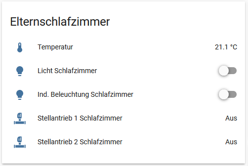

I always wanted to have some custom icons for my [Home-Assistant](https://www.home-assistant.io/) setup.
Unfortunately, if you set a SVG directly via URL (/local/myicon.svg) it does not change color depending on its state.
On the other hand, if you set an [MDI](https://materialdesignicons.com/) icon, the color changes.

So I looked for ways to get color changing icons and came across [Thomas Lovén's](https://github.com/thomasloven) [hass-fontawesome](https://github.com/thomasloven/hass-fontawesome) that does exactly that for the Font-Awesome icons.

I tried to use his `generate.py` to generate a custom font file from my SVG's but it failed.
After looking into it, I change quite a bit so that the script worked for me (see [my fork](https://github.com/Bouni/hass-fontawesome/blob/master/generate.py)).

I struggled a bit getting my font to work but finally here's an example of what I got (the two bottom icons):



If you also want to create your own iconfont, here are some obstacles that made me strugle.

### 1. Make sure your SVG has just one path, the generate script will grab the first path and use that in the font file.

This is an example of a not working SVG, as you can see it contains multiple path nodes.

```xml
<?xml version="1.0" encoding="UTF-8" standalone="no"?>
<svg
   xmlns:dc="http://purl.org/dc/elements/1.1/"
   xmlns:cc="http://creativecommons.org/ns#"
   xmlns:rdf="http://www.w3.org/1999/02/22-rdf-syntax-ns#"
   xmlns:svg="http://www.w3.org/2000/svg"
   xmlns="http://www.w3.org/2000/svg"
   xml:space="preserve"
   style="enable-background:new 0 0 32 32;"
   viewBox="0 0 32 32"
   y="0px"
   x="0px"
   id="Ebene_1"
   version="1.1"><metadata
     id="metadata3356"><rdf:RDF><cc:Work
         rdf:about=""><dc:format>image/svg+xml</dc:format><dc:type
           rdf:resource="http://purl.org/dc/dcmitype/StillImage" /><dc:title></dc:title></cc:Work></rdf:RDF></metadata><defs
     id="defs3354" /><path
     style="fill:#73BA1B;"
     id="path4155"
     d="m 7,21 18,0 0,5 -18,0 0,-5 z" /><path
     style="fill:#73BA1B;"
     id="path4153"
     d="m 18,20 0,-5.789271 -4,0 L 14,20 l 4,0 z" /><path
     style="fill:#73BA1B;"
     id="path4151"
     d="m 5,20 0,0 c -0.6,0 -1,0.4 -1,1 l 0,5 c 0,0.5 0.4,1 1,1 l 0,0 c 0.5,0 1,-0.4 1,-1 L 6,21 C 6,20.4 5.6,20 5,20 Z" /><path
     style="fill:#73BA1B;"
     id="path4149"
     d="m 27,20 0,0 c -0.6,0 -1,0.4 -1,1 l 0,5 c 0,0.5 0.4,1 1,1 l 0,0 c 0.5,0 1,-0.4 1,-1 l 0,-5 c 0,-0.6 -0.4,-1 -1,-1 z" /><path
     style="fill:#73BA1B;"
     id="path4147"
     d="m 16,2.9960394 c -2.8,0 -5,1.5720509 -5,3.5728426 l 0,5.001981 c 0,0.428741 0.4,0.714568 1,0.714568 l 1,0 L 13,13 l 6,0 0,-0.714569 c 0.6,0 1,-0.285827 1,-0.714568 L 20,3.710608 C 20,3.2818668 19.6,2.9960394 19,2.9960394 l -3,0 z m 1.5,1.4291372 c 0.3,0 0.5,0.1429137 0.5,0.3572843 l 0,5.7165491 c 0,0.21437 -0.2,0.357284 -0.5,0.357284 -0.3,0 -0.5,-0.142914 -0.5,-0.357284 l 0,-5.7165491 c 0,-0.2143706 0.2,-0.3572843 0.5,-0.3572843 z m -3,1.4291372 c 0.3,0 0.5,0.1429138 0.5,0.3572842 l 0,4.287412 c 0,0.21437 -0.2,0.357284 -0.5,0.357284 -0.3,0 -0.5,-0.142914 -0.5,-0.357284 l 0,-4.287412 c 0,-0.2143704 0.2,-0.3572842 0.5,-0.3572842 z" /><path
     style="fill:#73BA1B;"
     id="path4161"
     d="m 22,23.5 a 6,6 0 0 1 -6,6 6,6 0 0 1 -6,-6 6,6 0 0 1 6,-6 6,6 0 0 1 6,6 z" /><path
     style="fill:#ffffff;"
     d="M 16 18.5 A 5 5 0 0 0 11.675781 21 L 20.322266 21 A 5 5 0 0 0 16 18.5 z M 11.677734 26 A 5 5 0 0 0 16 28.5 A 5 5 0 0 0 20.324219 26 L 11.677734 26 z "
     id="path4166" /></svg>
```

Simply use [Inkscape](https://inkscape.org/) for example an combine the paths using the appropriate tools.

### 2. Adjust the settings in the generator sxcript

There a 3 settings that can be adjusted in the `generate.py`.

```python
PREFFIX = "fas"
OUTFILE = "hass-fontawesome-solid.html"
SIZE = 1024
```

`PREFFIX` defines what will be the preffix you later on will use in your HA config. If you for example set it to `fas` you will define a icon in your config like `icon: fas:clone`

`OUTFILE` defines the name of the resulting html file.

`SIZE` defines the size of the iocns, let this value as it is.

Place the generator.py in the same folder as your SVG icons and run it from there: `python3 generator.py`. The resulting html will appear in the same folder.

### 3. Install the font file in the right place

Make sure you've created a `www` folder inside your Home Assistant config folder. In there, place the generated html file.

### 4. Configure the custom font file for use in your HA config

```markdown
frontend:
  extra_html_url:
    - /local/hass-custom-font.html
```

I used `cutomize_glob` to set one of my new icons for all of my heating valves like so:

```markdown
homeassistant:
  customize_glob:
    "binary_sensor.stellantrieb*":
       icon: lox:valve 
```

Restart HA after editing the config!

### 5. Make sure the cache of your browser doesn't fool you 

My firefox fooled me with its cache. Simply hit `Ctrl + Shift + Del` and make sure to delete the cache when trying to get the font working, after that refresh the browser with F5.


