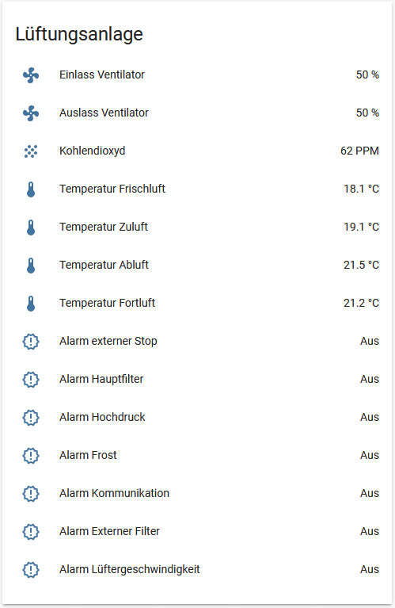

A while ago I built a Modbus RTU to Modbus TCP Gateway based on a Beaglebone Green and a RS485 Cape (check my [blog post](http://blog.bouni.de/posts/2016/modbus-tcp-to-modbus-rtu-gatway-on-a-beaglebone-green/) from back then).
It worked, but stoped working from time to time and I decided to fix that issue a few weeks ago. I updated the OS on the Beaglebone and realized that so many things changed since my initial implementation that I didn't want to invest to much time.

So I decided to use a USB to RS485 converter and plug that directly into my server and control the ventilation unit directly from Home-Assistant.

## Modbus configuration

*configuration.yaml*

```yaml
modbus:
  name: ventilation_unit
  type: serial
  method: rtu
  port: /dev/ttyUSB0
  baudrate: 19200
  stopbits: 1
  bytesize: 8
  parity: E
```

Nothing special here, the port must match the USB converter and the user that runs HA must have the rights to access the port (I had to add it to the uucp group).


*ventilation.yaml*

```yaml
- platform: modbus
  registers:
    - name: einlass_ventilator
      hub: ventilation_unit
      unit_of_measurement: '%'
      slave: 1
      register: 102
      register_type: input
    - name: Auslass Ventilator 
      hub: ventilation_unit
      unit_of_measurement: '%'
      slave: 1
      register: 103
      register_type: input
    - name: Alarm 
      hub: ventilation_unit
      slave: 1
      register: 101
      register_type: input
    - name: CO2 
      hub: ventilation_unit
      unit_of_measurement: 'PPM'
      slave: 1
      register: 10
      register_type: input
    - name: Temperatur Zuluft 
      hub: ventilation_unit
      unit_of_measurement: '°C'
      slave: 1
      register: 0
      register_type: input
      scale: 0.1
      offset: -30.0
      precision: 1
    - name: Temperatur Frischluft 
      hub: ventilation_unit
      unit_of_measurement: '°C'
      slave: 1
      register: 2
      register_type: input
      scale: 0.1
      offset: -30.0
      precision: 1
    - name: Temperatur Fortluft 
      hub: ventilation_unit
      unit_of_measurement: '°C'
      slave: 1
      register: 3
      register_type: input
      scale: 0.1
      offset: -30.0
      precision: 1
    - name: Temperatur Abluft 
      hub: ventilation_unit
      unit_of_measurement: '°C'
      slave: 1
      register: 6
      register_type: input
      scale: 0.1
      offset: -30.0
      precision: 1
```

I set up the registers that I want to read as documented in the [Modbus PDF from Alpha Innotec]({static}/blog/2019/lg327TB-hass-knx/Modbus OPT250 - 20130813.pdf) (they sent it to me years ago when I asked them).
The only think that's important is that the hub matches the name defined in `configuration.yaml`.

The only kind of special thing here is the alram. It gives me a binary representation of all alarms. I used template binary sensors to decode them.

```yaml
- platform: template
  sensors:
    alarm_external_stop:
      friendly_name: "Alarm Externer Stop"
      value_template: >-
        {{ states('sensor.alarm')|int|bitwise_and(1) }}
    alarm_main_filter:
      friendly_name: "Hauptfilter"
      value_template: >-
        {{ states('sensor.alarm')|int|bitwise_and(2) }}
    alarm_high_preasure:
      friendly_name: "Hochdruck"
      value_template: >-
        {{ states('sensor.alarm')|int|bitwise_and(4) }}
    alarm_frost:
      friendly_name: "Frost"
      value_template: >-
        {{ states('sensor.alarm')|int|bitwise_and(8) }}
    alarm_communication_error:
      friendly_name: "Kommunikationsfehler"
      value_template: >-
        {{ states('sensor.alarm')|int|bitwise_and(16) }}
    alarm_external_filter:
      friendly_name: "Externer Filter"
      value_template: >-
        {{ states('sensor.alarm')|int|bitwise_and(32) }}
    alarm_fan_speed:
      friendly_name: "Lüfter Geschwindigkeit"
      value_template: >-
        {{ states('sensor.alarm')|int|bitwise_and(64) }}
```

That enabled me to get the sensor data into HA:



*Snippet from the Lovelace UI config*

```yaml
- entities:
      - entity: sensor.einlass_ventilator
        icon: 'mdi:fan'
        name: Einlass Ventilator
      - entity: sensor.auslass_ventilator
        icon: 'mdi:fan'
        name: Auslass Ventilator
      - entity: sensor.co2
        icon: 'mdi:grain'
        name: Kohlendioxyd
      - entity: sensor.temperatur_frischluft
        icon: 'mdi:thermometer'
        name: Temperatur Frischluft
      - entity: sensor.temperatur_zuluft
        icon: 'mdi:thermometer'
        name: Temperatur Zuluft
      - entity: sensor.temperatur_abluft
        icon: 'mdi:thermometer'
        name: Temperatur Abluft
      - entity: sensor.temperatur_fortluft
        icon: 'mdi:thermometer'
        name: Temperatur Fortluft
	  - entity: binary_sensor.alarm_external_stop
        icon: 'mdi:alert-decagram-outline'
        name: Alarm externer Stop
      - entity: binary_sensor.alarm_main_filter
        icon: 'mdi:alert-decagram-outline'
        name: Alarm Hauptfilter
      - entity: binary_sensor.alarm_high_preasure
        icon: 'mdi:alert-decagram-outline'
        name: Alarm Hochdruck
      - entity: binary_sensor.alarm_frost
        icon: 'mdi:alert-decagram-outline'
        name: Alarm Frost
      - entity: binary_sensor.alarm_communication_error
        icon: 'mdi:alert-decagram-outline'
        name: Alarm Kommunikation
      - entity: binary_sensor.alarm_external_filter
        icon: 'mdi:alert-decagram-outline'
        name: Alarm Externer Filter
      - entity: binary_sensor.alarm_fan_speed
        icon: 'mdi:alert-decagram-outline'
        name: Alarm Lüftergeschwindigkeit
    show_header_toggle: false
    title: Lüftungsanlage
    type: entities
```

## Writing ventilation levels

So I was able to read but not to write. I asked in the discord channel how to achieve that and was pointed towards the `entity-button` card.
Unfortunately that card requires a `entity_id`, so I decided to create kind of a dummy entity.

*confguration.yaml*

```yaml
input_boolean:
  stufe:
    name: "Lüftung Stufe"
```

With that I created a `horizontal-stack` of `entity-button` cards

*Snippet from the Lovelace UI config*

```yaml
- cards:
      - entity: input_boolean.stufe
        hold_action:
          action: none
        icon: 'mdi:fan-off'
        name: Aus
        show_icon: true
        show_name: true
        tap_action:
          action: call-service
          service: modbus.write_register
          service_data:
            address: 100
            hub: ventilation_unit
            unit: 1
            value: 0
        type: entity-button
      - entity: input_boolean.stufe
        hold_action:
          action: none
        icon: 'mdi:numeric-1-box'
        name: Stufe 1
        show_icon: true
        show_name: true
        tap_action:
          action: call-service
          service: modbus.write_register
          service_data:
            address: 100
            hub: ventilation_unit
            unit: 1
            value: 1
        type: entity-button
      - entity: input_boolean.stufe
        hold_action:
          action: none
        icon: 'mdi:numeric-2-box'
        name: Stufe 2
        show_icon: true
        show_name: true
        tap_action:
          action: call-service
          service: modbus.write_register
          service_data:
            address: 100
            hub: ventilation_unit
            unit: 1
            value: 2
        type: entity-button
      - entity: input_boolean.stufe
        hold_action:
          action: none
        icon: 'mdi:numeric-3-box'
        name: Stufe 3
        show_icon: true
        show_name: true
        tap_action:
          action: call-service
          service: modbus.write_register
          service_data:
            address: 100
            hub: ventilation_unit
            unit: 1
            value: 3
        type: entity-button
      - entity: input_boolean.stufe
        hold_action:
          action: none
        icon: 'mdi:numeric-4-box'
        name: Stufe 4
        show_icon: true
        show_name: true
        tap_action:
          action: call-service
          service: modbus.write_register
          service_data:
            address: 100
            hub: ventilation_unit
            unit: 1
            value: 4
        type: entity-button
    type: horizontal-stack
```

That results in 5 buttons that when clicked call a service provided by the Modbus integration that writes a certain value into a Modbus register and therby sets the speed of the ventilators.


## KNX integration

With my old solution I had two buttons on a [KNX Glas button](https://www.mdt.de/EN_Glas_Push_Buttons.html) that allowd me to control the level without using the phone.
The control was actually done by my [Loxone Miniserver](https://shop.loxone.com/enen/miniserver.html) that has a KNX interface, but I wanted to reduce the amount of things that this device does because I need a Windows Software to make changes to it and that sucks :-)

Also I want HA to be able to react on KNX telegrams, so here is how I solved this last task.

First I need to configure that the KNX integration fires an event whenever a KNX telegram is received. For the moment I decided to not set any filters.

*configuration.yaml*

```yaml
knx:
  fire_event: true
  fire_event_filter: ["*"]
```

Then I created an automation that reacts on a certain KNX Group Address with a data value of 1

*automation.yaml*

```yaml
- alias: 'Set ventilation level to 4 via KNX Switch'
  trigger:
    platform: event
    event_type: knx_event
    event_data:
      address: "6/1/162"
      data: 1
  action:
  - service: modbus.write_register
    data:
      address: 100
      hub: ventilation_unit
      unit: 1
      value: 4

- alias: 'Set ventilation level to 2 via KNX Switch'
  trigger:
    platform: event
    event_type: knx_event
    event_data:
      address: "6/1/161"
      data: 1
  action:
  - service: modbus.write_register
    data:
      address: 100
      hub: ventilation_unit
      unit: 1
      value: 2
```

The `trigger` ist set to `knx_event` and the `event_data` is like a filter to only react on a given Group address and data. The `action` calls the `modbus.write_register` service and sends the right values to the Modbus registers of the ventilation unit.


