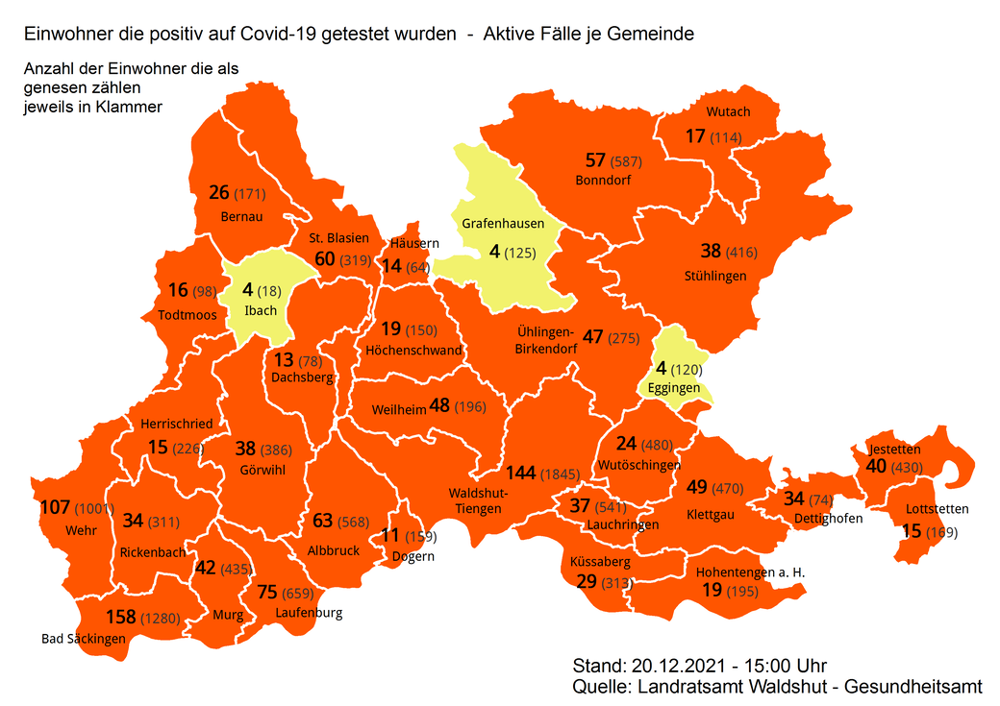
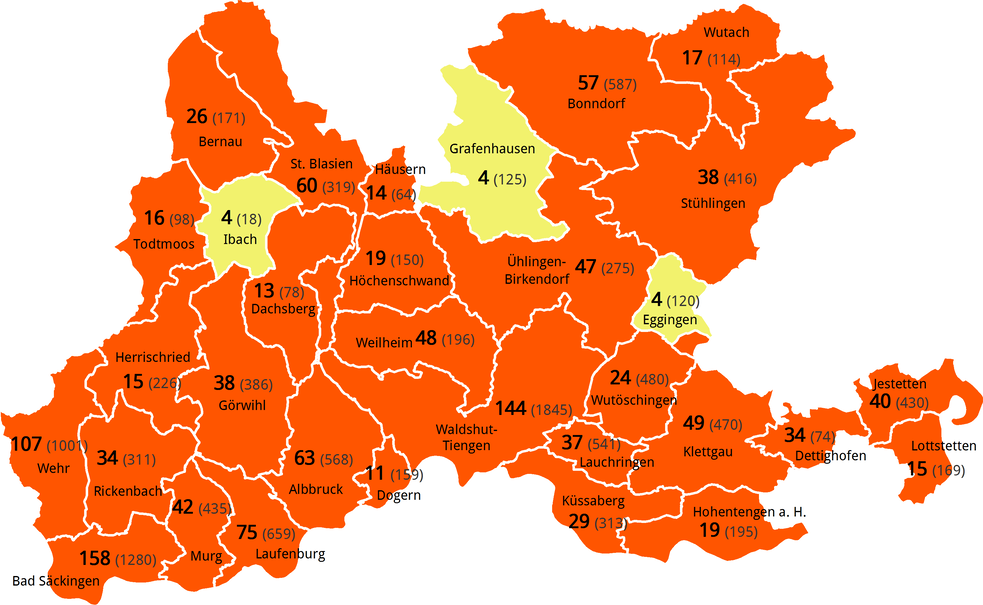
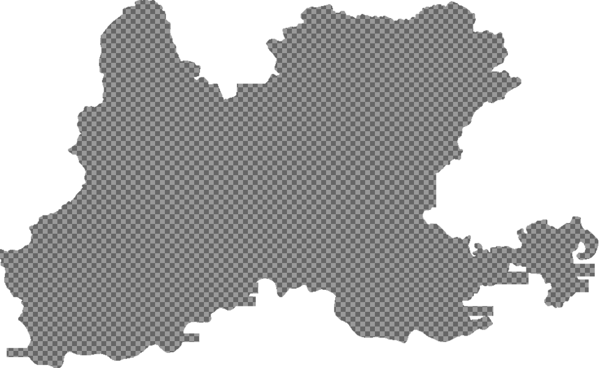

We're in a pandemic for approximately 2 years by now and sinc the beginning my couny administration is publishing a map that shows the Covid-19 cases per municipality on a regular basis.
So I creted a [Home-Assistant component](https://github.com/Bouni/corona_landkreis_waldshut) that downloads that map together with some data from their website and saves the images.
I had the plan to create a slideshow video every now an then from these images to show the change in infections.

<!--more-->

The administration staff are obviously bureaucrats which means that they suck at automating things :smirk:
They seem to create the above mentioned map by hand or at least in a semi-automatic proccess. The overlay texts are always in the same position, they changed over time every now an then but appart from that they are constant.
The map on the other hand is almost always in a different region.
That made the map jumping around in the video quite a bit and made the overall look and feel very unsatisfying as you can see in this animation (I reduced the number of frames to get the filesize down)


After discussing this problem with some folks of my [hackerspace](reaktor23.org/) I decided to go for a OpenCV approach to fix this issue.

First of all I create a working directory with a set of subfolders
```sh
mkdir -p opencv-maps/{original,cropped,final}
cd opencv-maps
tree -d
.
├── cropped
├── final
└── original
```

I then copied all of my original images into the `original` folder, they all have the same name structure `YYYY-MM-DD-Covid19-LK-Waldshut.png`.



Using [Gimp](https://www.gimp.org/) I created a image that only contained the map as a search template.



And an overlay that is commletely white with the map area transparent. I use that later on to get rid of the left over text.



Then I started creating the python script to do the work. 
I needed to install some dependencies first using pip `pip install opencv pillow`.

I'll go over the steps and show the entire script at the end.

### Import the dependencies and figure out the script path
```python
import os
from datetime import datetime as dt

import cv2
from PIL import Image, ImageDraw, ImageFont

BASEPATH = os.path.abspath(os.path.dirname(__file__))
```

### Read the template image, convert it to black and white and get its size
```python
# read needle image as grayscale
template = cv2.imread(os.path.join(BASEPATH, "map.png"), 0)
# convert all non white pixels to black
template[template != 255] = 0
# get the width and height of the map
w, h = template.shape[::-1]
```

### Iterate ov all original images and get the date from the filename
```python
# iterate over all the original images
for image in os.listdir(os.path.join(BASEPATH, "original")):

    print(f"Proccess original image {image}")
    # parse the date from the filename
    date = dt.strptime(image[:10], "%Y-%m-%d").strftime("%d.%m.%Y")
```

### Read the original image, create a black and white copy
```python
    # read the original image in RGB
    rgb = cv2.imread(os.path.join(BASEPATH, "original", image))
    # create a gray scale copy of it
    gray = cv2.cvtColor(rgb, cv2.COLOR_BGR2GRAY)
    # convert all non white pixels to black
    gray[gray != 255] = 0
```

### Search for the black and white template in the black and white original
```python
    # do a template search of the black and white map on the black and whit original
    res = cv2.matchTemplate(gray, template, cv2.TM_CCOEFF_NORMED)
```

### Get the best match from the set of serach results 
```python
    # get the best result from all the results
    min_val, max_val, min_loc, max_loc = cv2.minMaxLoc(res)
```

### Get the coordinates of the search result bounding box
```python
    # get the bounding box of the map in the original
    top_left = max_loc
    bottom_right = (top_left[0] + w, top_left[1] + h)
```

### Crop the original to the bounding box and save the image
```python
    # crop the original to the bounding box
    rgb = rgb[top_left[1] : top_left[1] + h, top_left[0] : top_left[0] + w]
    # save the croped image
    cv2.imwrite(os.path.join(BASEPATH, "cropped", f"cropped-{image}"), rgb)
```

### Overlay the cropped image with the overlay to get rid of the left over text
```python
    # load the croped image
    cropped_map = Image.open(os.path.join(BASEPATH, "cropped", f"cropped-{image}"))
    # load the overlay
    overlay = Image.open(os.path.join(BASEPATH, f"overlay.png"))
    # paste the overlay over the cropped map
    cropped_map.paste(overlay, (0, 0), overlay)
```

### Write the date in the top left corner and save the final image
```python
    # write the date in the top left corner with a slight offset of (10, 10)
    draw = ImageDraw.Draw(cropped_map)
    font = ImageFont.truetype(os.path.join(BASEPATH, "ubuntu.ttf"), 30)
    draw.text((10, 10), date, (0, 0, 0), font=font)
    # Save the final result
    cropped_map.save(os.path.join(BASEPATH, "final", f"{image}"))
```

### The full script
```python
import os
from datetime import datetime as dt

import cv2
from PIL import Image, ImageDraw, ImageFont

BASEPATH = os.path.abspath(os.path.dirname(__file__))

# read needle image as grayscale
template = cv2.imread(os.path.join(BASEPATH, "map.png"), 0)
# convert all non white pixels to black
template[template != 255] = 0
# get the width and height of the map
w, h = template.shape[::-1]

# iterate over all the original images
for image in os.listdir(os.path.join(BASEPATH, "original")):

    print(f"Proccess original image {image}")
    # parse the date from the filename
    date = dt.strptime(image[:10], "%Y-%m-%d").strftime("%d.%m.%Y")

    # read the original image in RGB
    rgb = cv2.imread(os.path.join(BASEPATH, "original", image))
    # create a gray scale copy of it
    gray = cv2.cvtColor(rgb, cv2.COLOR_BGR2GRAY)
    # convert all non white pixels to black
    gray[gray != 255] = 0

    # do a template search of the black and white map on the black and whit original
    res = cv2.matchTemplate(gray, template, cv2.TM_CCOEFF_NORMED)
    # get the best result from all the results
    min_val, max_val, min_loc, max_loc = cv2.minMaxLoc(res)

    # get the bounding box of the map in the original
    top_left = max_loc
    bottom_right = (top_left[0] + w, top_left[1] + h)

    # crop the original to the bounding box
    rgb = rgb[top_left[1] : top_left[1] + h, top_left[0] : top_left[0] + w]
    # save the croped image
    cv2.imwrite(os.path.join(BASEPATH, "cropped", f"cropped-{image}"), rgb)

    # load the croped image
    cropped_map = Image.open(os.path.join(BASEPATH, "cropped", f"cropped-{image}"))
    # load the overlay
    overlay = Image.open(os.path.join(BASEPATH, f"overlay.png"))
    # paste the overlay over the cropped map
    cropped_map.paste(overlay, (0, 0), overlay)

    # write the date in the top left corner with a slight offset of (10, 10)
    draw = ImageDraw.Draw(cropped_map)
    font = ImageFont.truetype(os.path.join(BASEPATH, "ubuntu.ttf"), 30)
    draw.text((10, 10), date, (0, 0, 0), font=font)
    # Save the final result
    cropped_map.save(os.path.join(BASEPATH, "final", f"{image}"))
```

### And last but not least, the resulting animation (reduced frame count)


There are still a few frames that are blury but thats because they published images with a low resolution on some days.
The result is not a 100% perfect but I'm pretty statisfied with it over all :smile:



