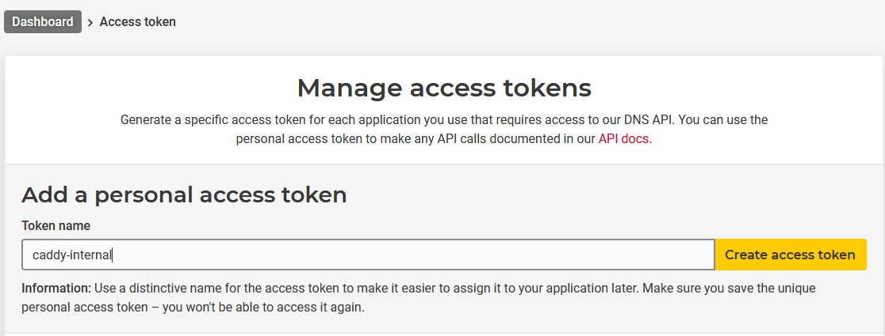

It took me quite a while to figure out how to get Let's encrypt SSL certificates for my subdomains that are not accessible from the internet. I struggled to find the right resources so I thought it might be a good idea to document my findings here :smile:

According to the caddy [docs](https://caddyserver.com/docs/automatic-https#dns-challenge), the DNS challenge is the way to go if you want SSL certs for a servie thats not accessible from the internet.
In order for it to work you need a caddy plugin for the DNS provider in use. Thankfully there [is one](https://github.com/caddy-dns/hetzner) for Hetzner already, which is my DNS provider.

Here's my folder structure:

```
├── caddy
│   ├── Caddyfile
│   ├── config
│   ├── data
│   └── Dockerfile
└── docker-compose.yaml
```

## Dockerfile

The first hurdle was that you cannot simply add a plugin to caddy, you have to build a custom caddy version.
This is not very hard though, the Dockerfile for the custom build is quite simple:

```Dockerfile
FROM caddy:builder AS builder
RUN xcaddy build --with github.com/caddy-dns/hetzner@v0.0.1

FROM caddy
COPY --from=builder /usr/bin/caddy /usr/bin/caddy
```

## Docker Compose

The docker-compose.yaml is also not very complex:

```yaml
version: "3.7"

services:
  caddy:
    build: ./caddy
    container_name: caddy
    restart: unless-stopped
    ports:
      - "80:80"
      - "443:443"
      - "443:443/udp"
    environment:
      - HETZNER_API_KEY=7zyeTRpkcRtaxDC8G8oaYXSwSr4TjSSj6SU7SR7w
    volumes:
      - ./caddy/Caddyfile:/etc/caddy/Caddyfile
      - ./caddy/data:/data
      - ./caddy/config:/config
```

The important parts are `build: ./caddy` and the env var `HETZNER_API_KEY=7zyeTRpkcRtaxDC8G8oaYXSwSr4TjSSj6SU7SR7w`.
To get an API key, simply use the Hetzner web interface to generate one



## Caddyfile

The caddyfile defines that it should use the DNS challenge with the Hetzner plugin:

```Caddyfile
{
	admin off
    log 
}

internal.bouni.de {
	respond "Hello"
    tls {
    	dns hetzner {env.HETZNER_API_KEY}
    }
}
``` 

The subdomain `internal.bouni.de` is not record in Hetzners DNS server, only in my local DNS records (I use [pihole](https://pi-hole.net/) for that).
Normally that would result in caddy not being able to get a cert for that subdomain.

But using the DNS challenge, caddy uses the Hetzner API to create a TXT record that holds a "certain value" (The actual words from the docs :smirk:) which allows Lets encrypt to verify that I'm in control of this domain.
It then issues a cert which is used by caddy.


