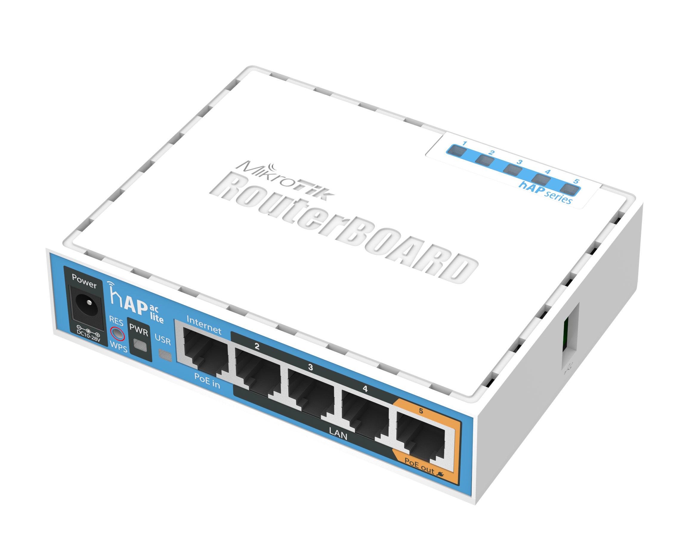
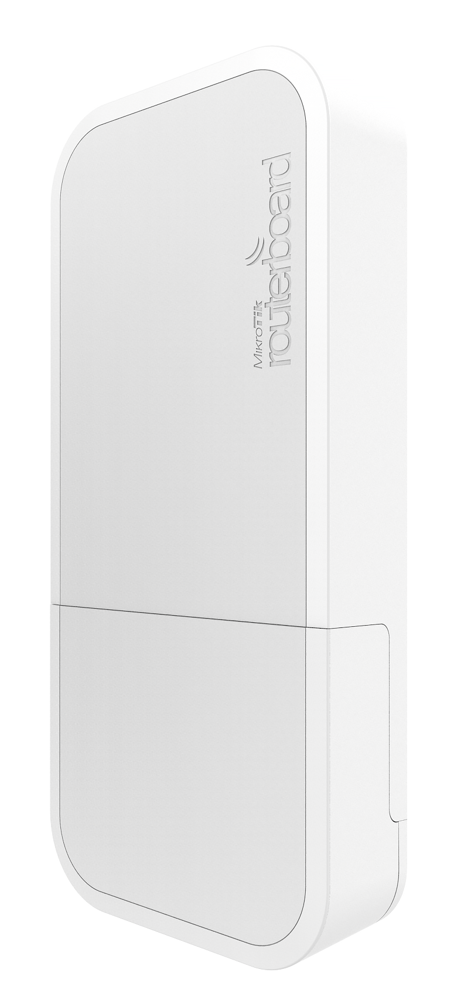
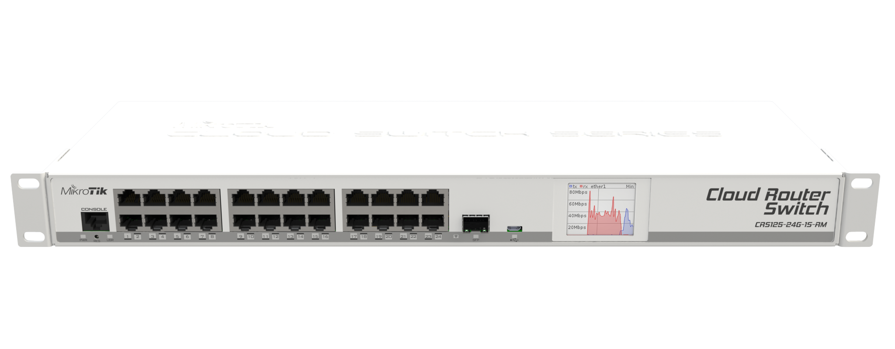
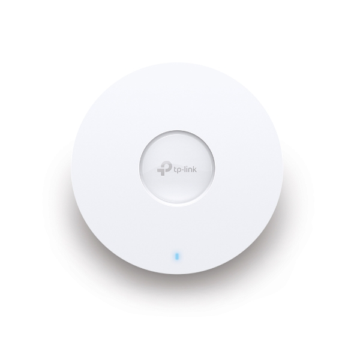
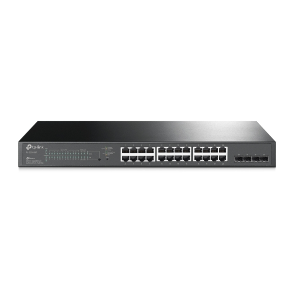
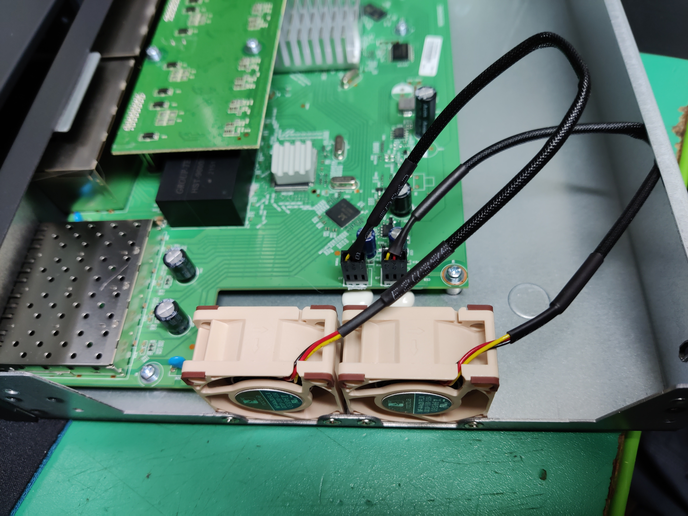

I'm in the process of upgrading my home wireless setup and here I document the proccess, maybe it helps some of you.

## Current setup

### Router

I use a Mikrotik hAP AC Lite as my router.

That decision was based on the fact that I got a direct fiber connection to my home when we built it back in 2015/2016.
My ISP installed a media converter box which gave me a single ethernet port, so my router had no need for a DSL modem, a simple PPPoE client is enough to connect.
Furthermore the hAP AC Lite was dirt cheap compared to a [FritzBox](https://avm.de/produkte/fritzbox/) which is the defacto standard here in Germany.

This router has built in 2.4Ghz/5Ghz wifi which was sufficiant to serve my clients in the basement where it is installed.
The most convincing feature for me at the time was Mikrotiks CAPsMAN, a wireless management feature that allows you deploy multiple APs that are managed by the CAPsMAN and do neat things like handover.

### Wireless APs

For the Accesspoints I went for the Mikrotik hAPs. 

These are 2.4Ghz only, but at the time the more advanced hAP AC where not yet available and I wanted clean looking APs that featured PoE.
The wAPs are mounted over recessed electrical mounting boxes with a single RJ45 Jack inside that lead to the Patchpanel in the basement.
As I only had these two PoE devices I went for the Passive PoE Injectors that came with the wAPs to lower the overall costs.

### Switch

As my main switch I use a Mikrotik CRS125-24G-1S-RM "Cloud Router Switch". 

## Why upgrade?

There are several reasons why I concider an upgarde for some time now.

First of all, the wAPs are 2.4Ghz only and I wanted 5Ghz for a long time but hesitated to buy wAP ACs as a replacement.
The reason for that is that I really struggled to get the config for the Mikrotik setup right.
The Wifi does not work very reliable, it seems to clog up evry now and then and my only workaround is a powercycle of the entire system.
Thats most likely due to my lack of networking knowledge and not the fault of the Mikrotik products.

## Future setup

### Router 

For now I'll stick with the Mikrotik hAP AC Lite and simply disable the Wifi.
I'm happy with it as a router, so why change it?

### Wireless APs

I ordered three TP-Link Omada EAP650 as my APs.

The are PoE+ capable as well so I can mount them in the same way as my old wAPs.

One for the ground floor, one for the first floor as direct replacment for my wAPs. The third will either go into my basement if the signal of the groundfloor AP is not strong enough for the basement.
If thats not a problem, I'll mount it in my garage to extend the coverage in my garden. My lawn mower robot drops from the wifi all the time which sucks :unamused:

### Switch

I want to get rid of the passiv PoE adapters as the look ugly in my Rack (stupid, I know but hey :smirk:) and the number of PoE devices went up at least by one and there are maybe more to come.
So I went for a TP-Link TL-SG2428P, a 24Port Gbit RJ45 PoE+ + 4Port Gbit SFP Switch that coumes from the Omada family and can be managed from the same software as the APs.

A major problem with this switch is that it has two 40mm fans built in that sound like jet engines. The lower their speed after a minute or so but still they are louder than any other piece of equipment in my house and are audibale in my living are which is a no go.

So I went for a mod and replaced the fans with Noctua NF-A4x20 FLX which is the go to recommendation all across the internet.

Important to notice is that you have to flip the whit plastic part that forms the connector by 180° in order to get the correct pinout for the Noctua fans. For whatever reason, thr original fans use a flipped pinout.

Kudos to [Calvin Bui](https://calvin.me) for pointing this out in his [fan mod blog post](https://calvin.me/tp-link-t1600g-28ps-fan-swap)!

### Controller

I decided to go for the Omada Software Controller instead of the Omada Hardware Controller becaus eits available as a docker container and can be self hosted. That also saves me approximately 100€ :sweat_smile:

## Fist impressions

Overall the new setup performs very good. I had to return one of the EAP650s though because it wouldn't power up via PoE and the replacement is still not shipped.
But at the moment all devices work fine with two APs as far as I can tell.

