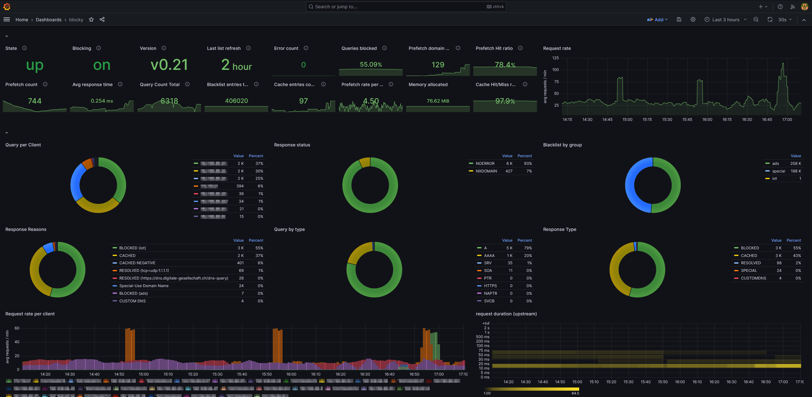

I ran [Pi-hole ](https://pi-hole.net/) as a docker container for several years now in order to block various unwanted DNS requests in my home network.
That kind of worked but I had a lot of issues that I wasn't able to solve or at least to figure out what caused them.

A few days ago this went sideways in a way that my entire network became unusable.
So I decided to get rid of Pi-hole and use the normal DNS servers provided by my ISP.

I considered using [AdGuard Home](https://adguard.com/de/adguard-home/overview.html) but I've read many things about it that let me hesitate.
Fortunately I stumbled accross [Blocky](https://0xerr0r.github.io/blocky) after looking for an altenative.

Blocky is a quote **"DNS proxy and ad-blocker for the local network written in Go"**.
It ticked several of my checkboxes:

- [x] Docker container available
- [x] Small footprint
- [x] Open Source Software
- [x] Easy to configure

So I gave it a shot and it didn't dissapoint me!

Here's my docker-compose.yaml snippet

```yaml
  blocky:
    container_name: blocky
    image: spx01/blocky
    restart: unless-stopped
    hostname: blocky
    ports:
      - "53:53/tcp"
      - "53:53/udp"
      - "4000:4000/tcp"
    environment:
      - TZ=Europe/Berlin
    volumes:
      - /etc/localtime:/etc/localtime:ro
      - /opt/docker/blocky/config.yml:/app/config.yml
```

And my config file (slightly redacted :smirk:)

```yaml
upstream:
  default:
    - 5.9.164.112
    - 1.1.1.1
    - tcp-tls:fdns1.dismail.de:853
    - https://dns.digitale-gesellschaft.ch/dns-query

upstreamTimeout: 2s

connectIPVersion: dual

customDNS:
  customTTL: 1h
  filterUnmappedTypes: true
  mapping:
    router: 192.168.88.1
    heatpump: 192.168.88.5
    feinstaubsensor: 192.168.88.20
    homeassistant: 192.168.88.25

blocking:
  blackLists:
    iot:
      - |
        /broadlink.com.cn/
    ads:
      - https://s3.amazonaws.com/lists.disconnect.me/simple_ad.txt
      - https://raw.githubusercontent.com/StevenBlack/hosts/master/hosts
      - http://sysctl.org/cameleon/hosts
      - https://s3.amazonaws.com/lists.disconnect.me/simple_tracking.txt
    special:
      - https://raw.githubusercontent.com/StevenBlack/hosts/master/alternates/fakenews/hosts
  clientGroupsBlock:
    default:
      - ads
      - special
      - iot
  blockType: zeroIp
  blockTTL: 1m
  refreshPeriod: 4h
  downloadTimeout: 4m
  downloadAttempts: 5
  downloadCooldown: 10s

caching:
  minTime: 5m
  maxTime: 30m
  maxItemsCount: 0
  prefetching: true
  prefetchExpires: 2h
  prefetchThreshold: 5
  prefetchMaxItemsCount: 0
  cacheTimeNegative: 30m

prometheus:
  enable: true
  path: /metrics

minTlsServeVersion: 1.3
bootstrapDns:
  - tcp+udp:1.1.1.1
  - https://1.1.1.1/dns-query
  - upstream: https://dns.digitale-gesellschaft.ch/dns-query
    ips:
      - 185.95.218.42

ports:
  dns: 53
  tls: 853
  http: 4000

log:
  level: info
  format: text
  timestamp: true
  privacy: false

```

This config is mostly based on the [reference config file](https://0xerr0r.github.io/blocky/configuration/)

I copy and pasted this reference config file to my config.yml and started commenting out most of the file.

My router is a Mikrotik hAP which also acts as my DHCP server. So the only thing I had to do is to set the IP of my server in the DHCP server confog as DNS server address: 

```zsh
[bouni@router] /ip/dhcp-server/network> print
Columns: ADDRESS, GATEWAY, DNS-SERVER
# ADDRESS          GATEWAY       DNS-SERVER
;;; defconf
0 192.168.88.0/24  192.168.88.1  192.168.88.20
```

Whenever a client obtains a new DHCP lease it gets this IP as DNS server and all its DNS queries are served by Blocky.

I don't bother that Blocky does not come with an UI for its configuration, for me that even a plus.
But not having nice graphs was something that needs to be solved.

On a cloud server I already run [Prometheus](https://prometheus.io/) and [Grafana](https://grafana.com/) wanted to use that for visualisation of Blocky's data.

To make the `/metrics` endpoint of blocky available for Prometheus I set up a subdomain `metrics.tld.de` which is a CNAME for my DDNS.
Next I setup my local caddy to reverse proxy the `/metrics` endpoint:

```caddy

*.tld.de, tld.de {
  
  tls {
    dns hetzner {env.HETZNER_AUTH_API_TOKEN}
  }

  @metrics host metrics.tld.de
  handle @metrics {
      basicauth * {
        prometheus $2a$14$Zkx19XLiW6VYouLHR5NmfOFU0z2GTNmpkT/5qqR7hx4IjWJPDhjvG 
      }
      reverse_proxy blocky:4000 
  }
}
```

As you can see I configured HTTP basic auth so that not everybody can query the data.
In my Prometheus scrape config I set this up as a target using the basic auth credentials:

```yaml
scrape_configs:                                                                                                                                                                                                  
  - job_name: 'blocky'                                                                                                                                                                                           
    scrape_interval: 60s                                                                                                                                                                                         
    static_configs:                                                                                                                                                                                              
      - targets: ['metrics.tld.de']                                                                                                                                                                            
    basic_auth:                                                                                                                                                                                                  
      username: 'prometheus'                                                                                                                                                                                     
      password: 'hiccup'
```

Blocky provides a ready to use [dashboard](https://grafana.com/grafana/dashboards/14980-blocky-query/) for Grafana but that wants an API endpoint.
I couldn't figure out how to set this up properly as my Prometheus instance is not on the same network as my Blocky instance, so I edited that out and made [my own version](https://gist.github.com/Bouni/f587f247d11889effc90ac91b946e8ae)



All in all I'm very happy with Blocky. It was such a smooth experiance compared to Pi-hole that I can only recommend to switch to Blocky :sunglasses:

