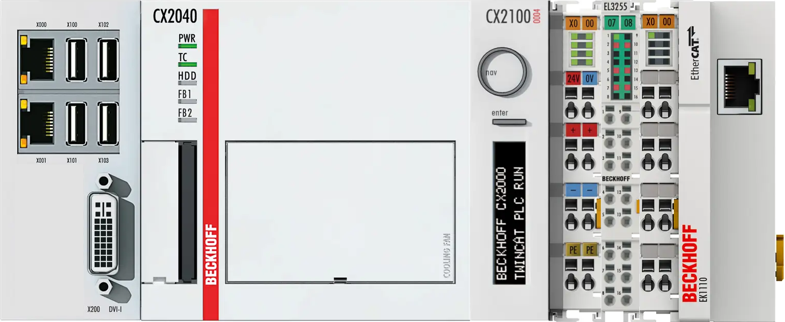

I got an old Beckhoff CX2040 that was no longer need into my hands and decided to try if I'll get LinuxCNC with EtherCat support running on there.

My setup consists of the [CX2040](https://www.beckhoff.com/en-en/products/ipc/embedded-pcs/cx20x0-intel-celeron-core-i7/cx2040.html) itself
and a [CX2100-0004](https://www.beckhoff.com/en-en/products/ipc/embedded-pcs/cx20x0-intel-celeron-core-i7/cx2100-0004.html) 45W power supply that alos features the E-Bus connector for additional I/O terminals.



The feature I'm most interested in is the so called CCAT FPPGA inside the CX2040 that allows to interface with the vast variety of Beckhoff I/O terminals and other EtherCat devices without the need of an dedicated Ethernet port.

As I wasn't able to find any guid on how to get this up and running I decided to write it down into this blog post so that others can benefit from it and I have a place that helps me compensate for my memory gaps in the future :smirk:

## LinuxCNC ISO

I downloaded the latest LinuxCNC ISO from their [website](http://linuxcnc.org/downloads/) which was **LinuxCNC 2.8.4 Debian 10 Buster PREEMPT-RT ISO** at the time of writing this.
Using Balea Etcher I wrote the ISO onto a USB stick and plugged it into the CX2040. After powering the device, hitting F7 repeatedly gets you into the boot selection menu.
I chose graphical install and installed the system on the CFast card, nothing special here.

After completing the installation I upgraded the system as a first step.

```
sudo apt update
sudo apt upgrade -y
```

## EtherCAT Master

I use the setup helper for the [EtherLab IgH EtherCAT Master](https://gitlab.com/etherlab.org/ethercat) by [ESS](https://github.com/icshwi/etherlabmaster) because it worked for me in [my last EtherCAT experiments](https://gist.github.com/Bouni/8b4532d0bdf012bd83c65d3eb62f8aa2) I did on a RaspberryPi 4.

First of all I installed several build requirements, the list is a extended version of what is listed in the repo README.

```
sudo apt install -y linux-headers-$(uname -r) build-essential libtool automake tree dkms git mercurial vim
```

After that I looked through the README and luckily it has [a section](https://github.com/icshwi/etherlabmaster#beckhoff-ccat-fpga-kernel-mode-driver-1) about CCAT :partying_face:

The first part of that secion points to another [repo by jeonghanlee](https://github.com/jeonghanlee/CCAT-env) that is also a helper script to build and install [Beckhoff's CCAT driver](https://github.com/Beckhoff/CCAT).

## CCAT driver

I followed the instructions whoch worked without any problems

```
git clone https://github.com/jeonghanlee/CCAT-env.git
cd CCAT-env

make init
make dkms_add
make dkms_build
make dkms_install

make setup
```

After that I did a `lsmod | grep ccat` which gave me a list off CCAT modules:

```
ccat_update            16384  0
ccat_systemtime        16384  0
ccat_sram              16384  0
ccat_gpio              16384  0
ccat_netdev            20480  0
ccat                   16384  2 ccat_sram,ccat_update
mfd_core               16384  2 ccat,lpc_ich
```

Nice :sunglasses:

But after a reboot the modules were not loaded anymore :slightly_frowning_face:

So I decided to do the `make setup` step again but that gave me an error that some linux kernel headers are missing.
I installed them with `sudo apt install linux-headers-4.19.0-23-rt-amd64` an tried again.

```
cd CCAT-env
make setup
```

That gave me

```
ccat
ccat_netdev
ccat_gpio
ccat_sram
ccat_systemtime
ccat_update
rmmod ccat_update
rmmod ccat_systemtime
rmmod ccat_sram
rmmod ccat
rmmod ccat_gpio
rmmod ccat_netdev
insmod /lib/modules/4.19.0-23-rt-amd64/updates/dkms/ccat.ko
insmod /lib/modules/4.19.0-23-rt-amd64/updates/dkms/ccat_netdev.ko
insmod /lib/modules/4.19.0-23-rt-amd64/updates/dkms/ccat_gpio.ko
insmod /lib/modules/4.19.0-23-rt-amd64/updates/dkms/ccat_sram.ko
insmod /lib/modules/4.19.0-23-rt-amd64/updates/dkms/ccat_systemtime.ko
insmod /lib/modules/4.19.0-23-rt-amd64/updates/dkms/ccat_update.ko


It is OK to see "RULES_DKMS: recipe for target 'setup' failed"
---------------------------------------------------------------------
crw------- 1 root root 244, 0 Apr 19 07:08 /dev/ccat_sram0
crw------- 1 root root 243, 0 Apr 19 07:08 /dev/ccat_update0
---------------------------------------------------------------------
```

After another reboot I chekd the modules with `lsmod | grep ccat` again and this time the loaded automatically.

## EtherCAT Master part 2

So the CCAT driver was sucessfully installed, time to go on with the instructions in the ESS repo.

```
cd ~
git clone https://github.com/icshwi/etherlabmaster.git
cd etherlabmaster
```

Now we need to check which intefrace is our CCAT interface. For that we simple do a `ip a`

```
1: lo: <LOOPBACK,UP,LOWER_UP> mtu 65536 qdisc noqueue state UNKNOWN group default qlen 1000
    link/loopback 00:00:00:00:00:00 brd 00:00:00:00:00:00
    inet 127.0.0.1/8 scope host lo
       valid_lft forever preferred_lft forever
    inet6 ::1/128 scope host
       valid_lft forever preferred_lft forever
2: enp2s0: <NO-CARRIER,BROADCAST,MULTICAST,UP> mtu 1500 qdisc pfifo_fast state DOWN group default qlen 1000
    link/ether 00:01:05:25:a9:c2 brd ff:ff:ff:ff:ff:ff
3: enp3s0: <BROADCAST,MULTICAST,UP,LOWER_UP> mtu 1500 qdisc pfifo_fast state UP group default qlen 1000
    link/ether 00:01:05:25:a9:c3 brd ff:ff:ff:ff:ff:ff
    inet 192.168.99.117/24 brd 192.168.3.255 scope global dynamic noprefixroute enp3s0
       valid_lft 2684sec preferred_lft 2684sec
    inet6 fe80::201:5ff:fe25:a9d3/64 scope link noprefixroute
       valid_lft forever preferred_lft forever
4: eth0: <BROADCAST,MULTICAST,UP,LOWER_UP> mtu 1500 qdisc pfifo_fast state UP group default qlen 1000
    link/ether 00:01:05:1e:6b:8e brd ff:ff:ff:ff:ff:ff
```

We have two Ethernet port on the CX2040 labeled `X000` and `X001`. My network cable was plugged into `X000` and `enp3s0` is up and got an IP address from my router.
So I guessed that `enp2S0` is the other port labeled `X001`. That leaves us with the interface `eth0` for the CCAT.

As shown in the instructions I set eth0 as my `ETHERCAT_MASTER0`

```
echo "ETHERCAT_MASTER0=eth0" > ethercatmaster.local
```

And from there I just followed the instructions

```
make init
echo "WITH_DEV_GENERIC = NO"  > configure/CONFIG_OPTIONS.local
echo "WITH_DEV_CCAT = YES" >> configure/CONFIG_OPTIONS.local
make ccat_patch
make build
make install
make dkms_add
make dkms_build
make dkms_install
make setup
```

After that I rebooted the CX2040.

I quickly checked if the ethercat service is up and running with `systemctl status ethercat.service`

```
● ethercat.service - EtherCAT Master Kernel Modules
   Loaded: loaded (/etc/systemd/system/ethercat.service; enabled; vendor preset: enabled)
   Active: active (exited) since Thu 2023-04-20 09:25:46 EDT; 32s ago
  Process: 803 ExecStart=/opt/etherlab/sbin/ethercatctl start (code=exited, status=0/SUCCESS)
 Main PID: 803 (code=exited, status=0/SUCCESS)
```

Indeed, it was :partying_face:

I went on and checked the status of the EtherCAT Master with `ethercat master`

```
Master0
  Phase: Idle
  Active: no
  Slaves: 2
  Ethernet devices:
    Main: 00:01:05:1e:6b:8e (attached)
      Link: UP
      Tx frames:   74266
      Tx bytes:    4572920
      Rx frames:   74266
      Rx bytes:    5761176
      Tx errors:   0
      Tx frame rate [1/s]:    125    125    187
      Tx rate [KByte/s]:      7.3    7.3   11.2
      Rx frame rate [1/s]:    125    125    187
      Rx rate [KByte/s]:      9.3    9.3   14.1
    Common:
      Tx frames:   74266
      Tx bytes:    4572920
      Rx frames:   74266
      Rx bytes:    5761176
      Lost frames: 0
      Tx frame rate [1/s]:    125    125    187
      Tx rate [KByte/s]:      7.3    7.3   11.2
      Rx frame rate [1/s]:    125    125    187
      Rx rate [KByte/s]:      9.3    9.3   14.1
      Loss rate [1/s]:          0     -0     -0
      Frame loss [%]:         0.0   -0.0   -0.0
  Distributed clocks:
    Reference clock:   Slave 0
    DC reference time: 0
    Application time:  0
                       2000-01-01 00:00:00.000000000
```

It report 2 slaves found because I already connected a [EL3255](https://www.beckhoff.com/en-en/products/i-o/ethercat-terminals/el3xxx-analog-input/el3255.html), which is a 5 port analog terminal
and an [EK1110](https://www.beckhoff.com/en-en/products/i-o/ethercat-terminals/ek1xxx-bk1xx0-ethercat-coupler/ek1110.html) which is an EtherCAT extension that eventually allows me to connect EtherCAT servo drives to the bus.

I wanted to see the the details so that I can verify that the devices are correctly recognized by entering `ethercat slaves -v`

```
=== Master 0, Slave 0 ===
Device: Main
State: PREOP
Flag: +
Identity:
  Vendor Id:       0x00000002
  Product code:    0x0cb73052
  Revision number: 0x00170000
  Serial number:   0x00000000
DL information:
  FMMU bit operation: no
  Distributed clocks: yes, 64 bit
  DC system time transmission delay: 0 ns
Port  Type  Link  Loop    Signal  NextSlave  RxTime [ns]  Diff [ns]   NextDc [ns]
   0  EBUS  up    open    yes             -   1347169212           0           0
   1  EBUS  up    open    yes             1   1347169522         310         155
   2  N/A   down  closed  no              -            -           -           -
   3  N/C   down  closed  no              -            -           -           -
Mailboxes:
  Bootstrap RX: 0x1000/244, TX: 0x10f4/244
  Standard  RX: 0x1000/128, TX: 0x1080/128
  Supported protocols: CoE, FoE
General:
  Group: AnaIn
  Image name:
  Order number: EL3255
  Device name: EL3255 5K. Potentiometerauswertung mit Sensorversorgung
  CoE details:
    Enable SDO: yes
    Enable SDO Info: yes
    Enable PDO Assign: yes
    Enable PDO Configuration: no
    Enable Upload at startup: no
    Enable SDO complete access: no
  Flags:
    Enable SafeOp: no
    Enable notLRW: no
  Current consumption: 80 mA
=== Master 0, Slave 1 ===
Device: Main
State: PREOP
Flag: +
Identity:
  Vendor Id:       0x00000002
  Product code:    0x04562c52
  Revision number: 0x00110000
  Serial number:   0x00000000
DL information:
  FMMU bit operation: no
  Distributed clocks: yes, delay measurement only
  DC system time transmission delay: 155 ns
Port  Type  Link  Loop    Signal  NextSlave  RxTime [ns]  Diff [ns]   NextDc [ns]
   0  EBUS  up    open    yes             0   1724581792           0         155
   1  MII   down  closed  no              -            -           -           -
   2  N/A   down  closed  no              -            -           -           -
   3  N/C   down  closed  no              -            -           -           -
General:
  Group: System
  Image name:
  Order number: EK1110
  Device name: EK1110 EtherCAT-Verl�ngerung
  Flags:
    Enable SafeOp: no
    Enable notLRW: no
  Current consumption: 130 mA
```

So the EtherCAT bus seems to work as expected.

No we want to integrate all of that into LinuxCNC.

## LinuxCNC with EtherCAT

```
cd ~
git clone https://github.com/linuxcnc-ethercat/linuxcnc-ethercat.git
cd linuxcnc-ethercat
make configure
```

building with `make` lead to an error that `ecrt.h` could not be found, so I symlinked that

```
sudo ln -s /opt/etherlab/include/ecrt.h /usr/include/linuxcnc/ecrt.h
```

After that the linker wasn't able to find `libethercat.so` so again, I symlinked that as well

```
sudo ln -s /opt/etherlab/lib/libethercat.so /usr/lib/libethercat.so
```

With these little hacks in place I was able to build and install

```
make
make install
```

## CIA-402 HAL compnent

In order to use servodrives I added the CIA-402 HAL compnent by `dbraun`

```
cd ~
git clone https://github.com/dbraun1981/hal-cia402
cd hal-cia402
sudo halcompile --install cia402.comp
```

## LinuxCNC EtherCAT setup

As a quick test I started LinuxCNC, selected sim → axis → axis and let it save the files.

Then I created a `ethercat.hal` file in `~/linuxcnc/configs/sim.axis/`

```
loadusr -W lcec_conf ethercat-conf.xml
loadrt lcec
addf lcec.read-all servo-thread
addf lcec.write-all servo-thread
```

After that I created a `ethercat-conf.xml` in the same directory

```
<masters>
<master idx="0" appTimePeriod="1000000" refClockSyncCycles="5">
      <slave idx="0" type="EL3255" />
</master>
</masters>
```

As a last step I edited the `~/linuxcnc/configs/sim.axis/axis.ini` file

```
...
# Hardware Abstraction Layer section --------------------------------------------------
[HAL]

# The run script first uses halcmd to execute any HALFILE
# files, and then to execute any individual HALCMD commands.
#

# list of hal config files to run through halcmd
# files are executed in the order in which they appear
HALFILE = core_sim.hal
HALFILE = sim_spindle_encoder.hal
HALFILE = axis_manualtoolchange.hal
HALFILE = simulated_home.hal
HALFILE = check_xyz_constraints.hal
HALFILE = ethercat.hal
...
```

in there I just added the line `HALFILE = ethercat.hal`

After starting LinuxCNC using the desktop icon I went to `Machine → HAL Configuration` where I went to `Pins → lcec → 0 → 0`

Here I was presented with a list of `pot-...` pins that belonged to the EL3255 I/O terminal :partying_face:

Everything seems to work so far. I'll continue this in another blog post soon
