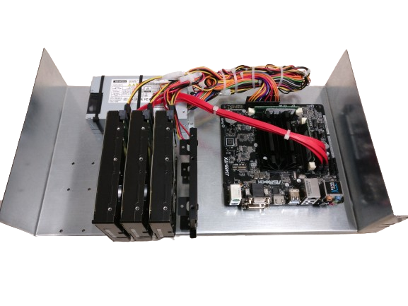

Back in 2016 when we completed building our house I installed a home server in my basement networking rack which I always refer to as the "open wound" :grin:
That's because It is mounted on a laser cut sheet of zinc coated sheet metal that forms a rack mount shelf and looks hacky as hell.

These pictures are from day 1 and some things have changed in the meantime.

At the moment the setup consists of:

* 350W FlexATX power supply
* [ASRock J3455-ITX motherboard](https://asrock.com/mb/Intel/J3455-ITX/)
* [16GB (2x8GB) Crucial DDR3 SO-DIMM RAM](https://www.crucial.com/memory/ddr3/ct102464bf160b)
* [256GB Samsung 850 EVO SATA SSD system disk](https://www.samsung.com/ch/support/model/MZ-75E2T0B/EU/)
* 2x [KINGSTON SA400S3 SATA SSD for storage](https://www.kingston.com/de/ssd/a400-solid-state-drive?partnum=sa400s37%2F960g)

Very quickly after I started using this system I replaced the 3 WD RED HDDs shown in the pictures with the SSD listed above because SSD > HDD and I heard the humming of the disks at night through the stairwell ad they used to much power for my taste.
I also suffered sudden system freezes every now an then. It took me a while to find out that one of the original RAM modules was faulty. Memtest86+ for the win!

But apart from the system served me very well over the years.

With the time a lot of new docker containers were added and now the system is just to slow for me and I want to evolve it.

# The future

After watching a Youtube [video on Wolfgang's channel](https://www.youtube.com/watch?v=vjDoQA4C22c) I was very interested in the Topton Mainboard he shows.
I don't know where the brand name Topton comes from, but I think these boards are made by [BKHD Industrial Solution](https://www.bkipc.com/en/product/BK-NVR-N5105-NAS-MB.html)

I found a [HW-NVR-N5105](https://de.aliexpress.com/item/1005006134113828.html) on AliExpress and ordered it for roughly 120€.

It has 

 * An Intel Celeron N5105 processor with 4 cores and 4 Threads
 * 2x DDR4 SO-DIMM Slots that can take up to 64GB of RAM
 * 2x M.2 M-Key that can take 2 2280 NVMe SSDs
 * 4x 2.5GB Ethernet Ports 
 * 6x SATA ports for additional disks

The CPU is roughly twice as fast as the old J3455

## Hardware

I got a pretty good deal on 2x 2TB NVMe SSDs from Crucial, [Crucial P3 Plus CT2000P3PSSD801](https://www.crucial.de/ssd/p3-plus/ct2000p3pssd8) to be more precise, for only 84€ each.
With the RAM i decided to go all in and get a 2x32GB Kit. Again I got lucky and found a [Kingston FURY SO-DIMM 64 GB DDR4-3200 (2x 32 GB) Dual-Kit](https://www.kingston.com/de/memory/search?partid=KF432S20IBK2%2F64) for 120€.
Last but not least, I looked for a highly efficient ATX power supply. I read that the Corsair RM550x is the got to PSU for that, but it was no where available.
So I went for a [Corsair RM650](https://www.corsair.com/de/de/p/psu/cp-9020194-eu/rm-series-rm650-650-watt-80-plus-gold-certified-fully-modular-psu-eu-cp-9020194-eu) instead which costed me another 85€.

With the SATA disks, I decided to use the disks that are currently mounted in my old system.

## Case

I again plan to build my own case because I can :grin:

This the first draft:

The rectangular dark are in the front is something I planed long to integrate. Its a PCB that has two push buttons for power and reset and a Power LED and a HDD LED like a normal PC case.
But additionally it will have an ESP32 that can detect the power signal via an optocoupler and emulate the reset and power button with optocouplers.
Think of it as a poor mans KVM / remote power control :grin:

I'll add a picture once I'm done with the PCB.

That's it for this part, soon part 2 will follow.
