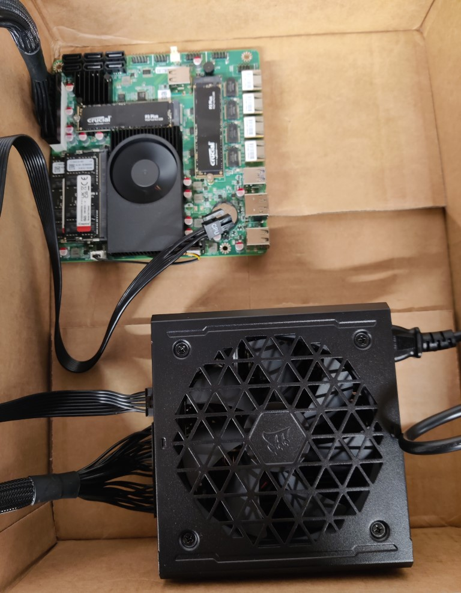
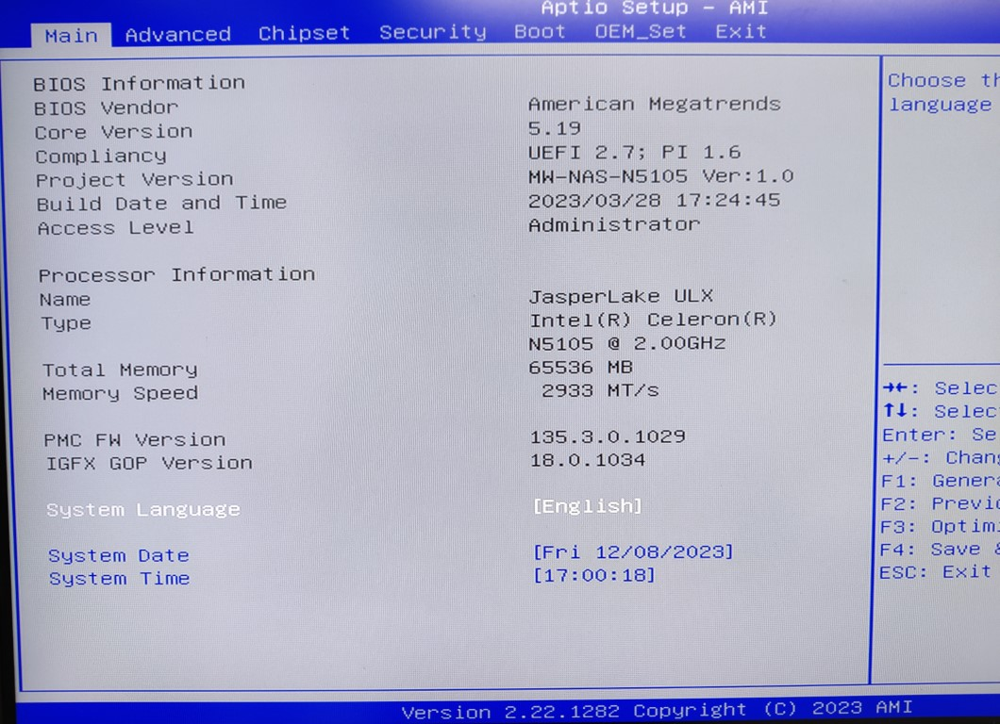
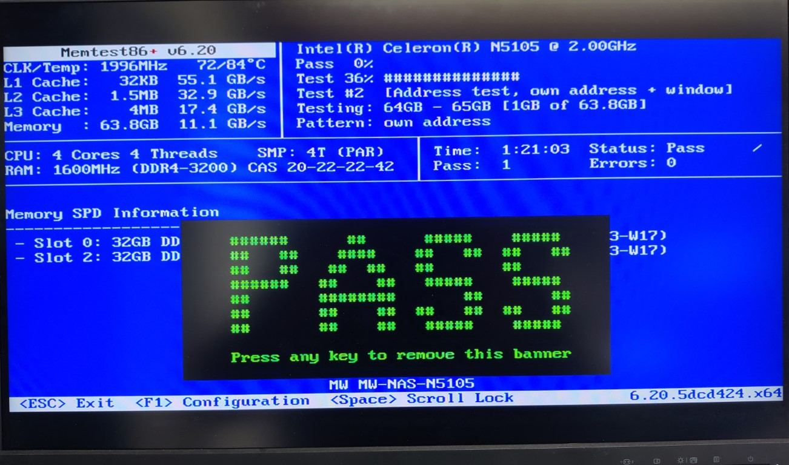
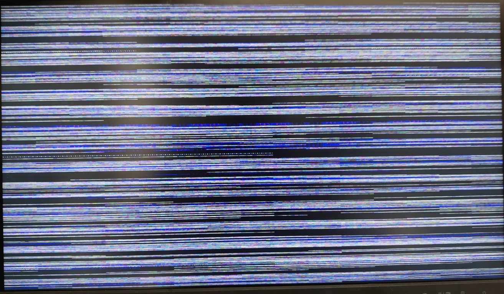
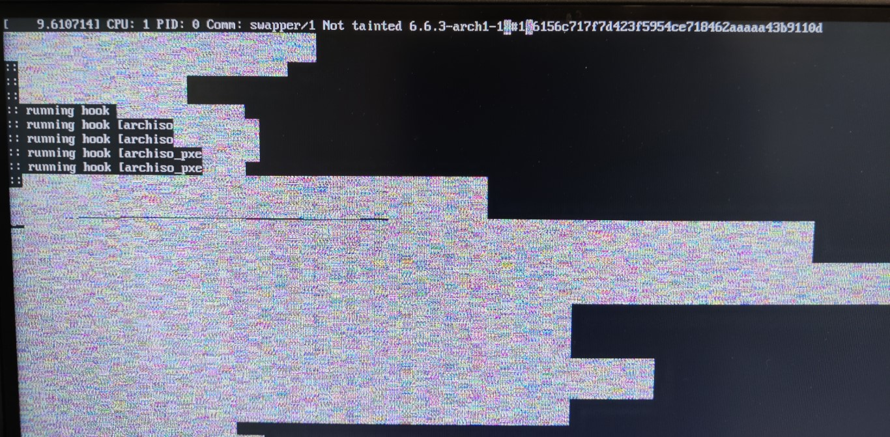
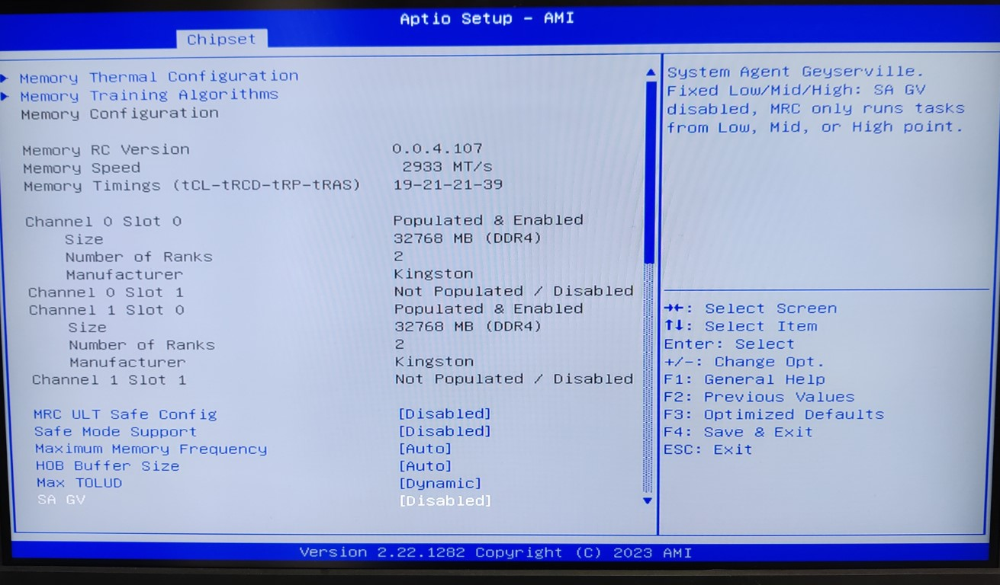

I'm still planing the case, so I decided to test the hardware in a cardboard box for now.

<!--more-->

After putting all components together and power it up, at first nothing happened, just the CPU fan and the PSU fans started spinning. 
The later stopped after a few seconds but the screen stayed black. :worried:

Then after about 30 Seconds the whole thing turned off and on again by itself, followed by a weird long beep :monocle_face:

But then I landed directly in the BIOS :partying_face:

I immediately spotted the 64GB of RAM, nice :star_struck:
Next I checked the NVMe disks and they showed up as well with ~1.8T each.

As I experienced RAm issues in my last home server I wanted to be sure from the start and check the RAM using memtest.

I flashed a USB stick with [Memtest86+](https://www.memtest.org/) and let it do its thing.

Looks good! Lets install an OS I thought.

# NixOS

For this new server I plan to use NixOS, it has a very steep learning curve but a lot of benefits.
So I prepared a NixOS USB boot stick with NixOS 23.11 graphical installer on it.

After plugging it in and power cycle the system, it began booting from the stick as expected.
But seconds later I was shocked when I saw a tearing screen of white noise :fearful:

It tried it again, almost the same result.

I thought, well maybe an issue with the HDMI/DP Port. But as its goinf to be a headless server anyway, lets try the NixOS minimal console installer.

Nope, again a tearing screen.

Maybe a NixOS specific problem? Lets go for my long term OS of choice, Arch linux then.

Fu**, again the same issue.

What next? Message the seller on AliExpress and send the board back?
Shipping was fast and cheap but sending this thing back to China will cost a fortune for sure.

Maybe the RAM? But Memtest said it was all OK. Maybe the board cannot really handle 64GB?

So I took one component after another out, tested again, put it back in and so on. No success at all :sob:

I started googling for this specific issue but found nothing. The only real source of information on this board seems to be the [servethehome forums](https://forums.servethehome.com/index.php?threads/topton-nas-motherboard.37979/).

I posted a question with screenshots but got no answer. So I began reading the entire thread, hoping to find something.

At first I was looking for BIOS updates because I thought that that might solve the issue.

I found a link to the website of the actual manufacturer [BKIPC](https://www.bkipc.com/en/product/BK-NVR-N5105-NAS-MB.html) and there is a link to a BIOS update ZIP file, but no instructions on how to get it onto the board.

Th BIOS says it is version **NW-NAS-N5105 Ver:1.0**, the ZIP file has a change date of **2023-08-04**.
After downloading the ZIP I quickly realized that it contains a .nsh file with that date, but the actual BIOS .bin file has the same date as the already installed BIOS.
So I didn't want to risk bricking the board and went on with my search.

Finally I stumbled upon [a post](https://forums.servethehome.com/index.php?threads/topton-nas-motherboard.37979/post-377379) of user [JuanT](https://forums.servethehome.com/index.php?members/juant.50830/) where he described the same issues I had and that he found the solution in disabling the **SA GV** in the BIOS, located under **Chipset -> System Agent (SA) Configuration -> Memory Configuration**.

Doing that resulted in a proper boot into the boot stick :partying_face:

## RAID 1

My plan was to have a RAID 1 over the two NVMe disks so that if one fail, the system continues to work as expected.
Later I plan to add all my SATA SSDs to the SATA ports and use [mergerfs](https://github.com/trapexit/mergerfs) + [snapraid](https://www.snapraid.it/) on them, but more on that in a later post.

As I have never used a Software RAID before, I asked my fellow hackers in the Reaktor23 chat for help.
Sure enough they 

