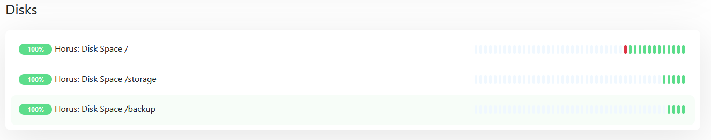

I use [Uptime Kuma](https://uptime.kuma.pet/) as my self hosted monitoring solution and it worked perfectly find so far.
But every now an then I run out of disk space on my Hetzner cloud server because they have only 15G in the smallest variant.

Thats very annoing but on the other hand I hesitate to run a full blown monitoring solution.

So today I realized that Uptime Kuma now has the ability to add a so called passive monitor where it does not actively ping a resource but receive a request.

That allows me to monitor the disk space with a sript that gets called by a systemd timer every 10 minutes.

Here's the script I came up with:

```bash
#!/bin/bash

BASE_URL="https://uptime.bouni.de/api/push/"

disks=("/dev/sda1")
alerts=(85)
urls=("pCDwxPLOoI")

check () {
  DISK=$1
  ALERT_LEVEL=$2
  URL_HASH=$3

  disk_usage=`/usr/bin/df -h $DISK | /usr/bin/tail -n +2 | /usr/bin/awk 'END {print $5}' | /usr/bin/tr -d "%"`
  # Get disk space in GB
  disk_space=`/usr/bin/df -h $DISK | /usr/bin/tail -n +2 | /usr/bin/awk 'END {print $2}'`
  # get used disk space in GB
  used_space=`/usr/bin/df -h $DISK | /usr/bin/tail -n +2 | /usr/bin/awk 'END {print $3}'`
  # get free disk space in GB
  free_space=`/usr/bin/df -h $DISK | /usr/bin/tail -n +2 | /usr/bin/awk 'END {print $4}'`
  # get mount point
  mount_point=`/usr/bin/df -h $DISK | /usr/bin/tail -n +2 | /usr/bin/awk 'END {print $6}'`

  # Check if disk usage is higher than 85%
  if [ $disk_usage -gt $ALERT_LEVEL ]; then
    # Send push notification
    /usr/bin/curl -k --get \
      --data-urlencode "msg=Disk usage on ${mount_point} is high: ${disk_usage}% (${free_space}/${used_space}/${disk_space})" \
      --data-urlencode "status=down" \
      "${BASE_URL}${URL_HASH}"
  else
    /usr/bin/curl -k --get \
      --data-urlencode "msg=Disk usage on ${mount_point} is OK: ${disk_usage}% (${free_space}/${used_space}/${disk_space})" \
      --data-urlencode "status=up" \
      "${BASE_URL}${URL_HASH}"
  fi
}

for (( i=0; i<${#disks[@]}; i++ )); do
    check ${disks[$i]} ${alerts[$i]} ${urls[$i]}
done
```

At the top are three arrays in which I configure the disk device, the alert level and the hash from the Uptime Kuma push URL for each disk I want to be monitored.

The script then loop over all configured disks, gets the data for that disk, compares the free space to a threshold and sends the right request to my uptime instance.
By setting the GET parameter `status` to either `up` or `down` I decide if everything is still fine or not.
It even allows to have a custom message for the logs using the `msg` parameter.

The systemd service file looks like this:

```systemd
[Unit]
Description=Sends disk space stats to Uptime Kuma

[Service]
Type=oneshot
ExecStart=/opt/scripts/diskspace.sh
```

And the correspondig systemd timer file:

```systemd
[Unit]
Description=Sends disk space stats to Uptime Kuma

[Timer]
OnCalendar=*:0/10

[Install]
WantedBy=timers.target
```

The result in Uptime Kuma looks like this:


