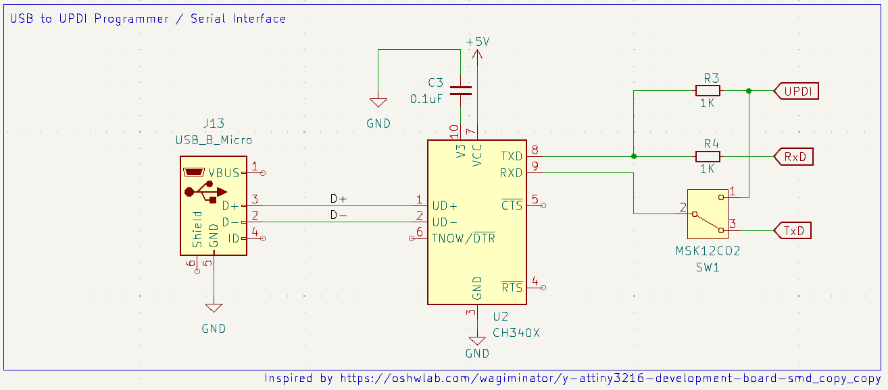
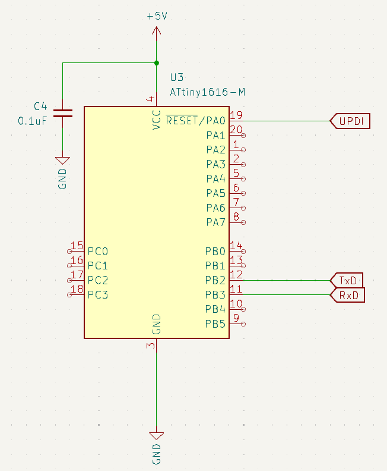

I recently started a small side project at work in which I was in need for a microcontroller. In almost every project I did in recent years I used a ESP32 out of convenience or need for wifi.
However in this project Space was an issue, so huge module like that was not very appropriate.
I just need a few I/O pins and maybe a serial port for debugging, that's it.

So I began looking for what could fit my needs and ended up with the Attiny1616. It has an internal oscillator, comes in a VQFN package of just 3x3mm and needs no eternal components.
It also features the relatively new UPDI interface for programming and debugging, which only blocks a single I/O pin.

I planned to use [PlatfomIO](https://platformio.org/) for the programming. The docs stated that the Attiny1616 is [supported](https://docs.platformio.org/en/latest/boards/atmelmegaavr/ATtiny1616.html).

# The hardware

After looking around for some time in order to find a example circuit I found this one from [@wagiminator](https://oshwlab.com/wagiminator/y-attiny3216-development-board-smd_copy_copy#P2).

I changed it slightly to use the CH340X instead of the CH340N because it uses the MSOP-10 package with just 3.0x4.9mm instead of the SOP-8 with 5.5x6.0mm.
But I really liked the switch that allows to switch between programming and UART, so I kept that. This is the circuit I ended up with:



It is connected to the Attiny1616 like this:



The board worked on the first try :party_face:

# The software

I got the upload working within minutes using this `platformio.ini`

```ini
[env]
platform = atmelmegaavr
board = ATtiny1616
framework = arduino
monitor_speed = 115200

[env:udpi]
upload_flags =
    --tool
    uart
    --device
    $BOARD_MCU
    --uart
    $UPLOAD_PORT
    --clk
    $UPLOAD_SPEED
upload_command = pymcuprog write --erase $UPLOAD_FLAGS --filename $SOURCE
```

I needed to install `pymcuprog` with `pip install pymcuprog` but that was a no brainer.

My first test code was a blink sketch for a LED connected to `PA1`

```cpp
#include <Arduino.h>

#define HEARTBEAT_LED         PIN_PA1

void setup() {
  pinMode(HEARTBEAT_LED, OUTPUT);
  Serial.begin(115200);
}

void loop() {
  digitalWrite(HEARTBEAT_LED, HIGH);
  delay(100);
  digitalWrite(HEARTBEAT_LED, LOW);
  delay(100);
  Serial.println("Hello");
}
```

The upload has to be done with this command `pio run -e updi -t upload`.

The LED started to blink as expected :sunglasses:

# Problems

I had another LED on `PB5`, so I tested that as well by simply changing the #define at the top of my test program. And here the problems began.
The compiler gave me an error `error: 'PIN_B5' was not declared in this scope`.

After numerous attempts to fix this issue I went to the PlatfomIO forum, where someone helped me solve the issue really quickly.
The solution was to delete various folders so that PlatformIO had to download / build them fresh.

- .pio
- C:\Users\<user>\.platformio\packages\framework-arduino-megaavr-megatinycore\
- C:\Users\<user>\.platformio\platforms\atmelmegaavr
- C:\Users\<user>\.platformio\.cache

In the meantime I discovered that the Serial port didn't work as expected as well.

After switching the UPDI Switch, I received just gibberish instead of the expected "Hello".

Again the same user in the forum saved me!

Turns out the default clock speed PlatformIO uses for the Attiny1616 is 16Mhz but this model (Attiny1616-MNR) seems to use 20Mhz.

So I had to add `board_build.f_cpu = 20000000L` to the `[env]` section of my `platformio.ini`.

After that everything worked as expected.

All in all a very pleasant experience and I think I will use Attiny micro controllers in future projects again. 
