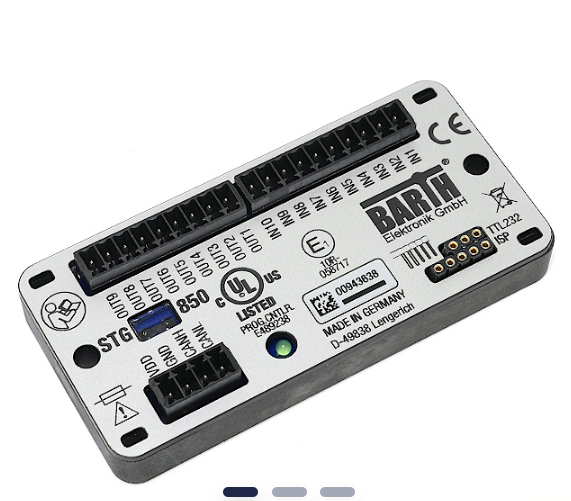

I'm planning to use a [Barth Elektronik STG-850 mini-PLC](https://barth-elektronik.com/en/lococube-mini-PLC-STG-850/0850-0850) for a project.
The main reason to pick this PLC was the size of just 93x45x15mm, the low price of 150€ (low for an industry grade PLC) and the claim to support "Open Source programming" using the Arduino IDE.



In the meantime that claim is no longer on their website and the manual for it is gone as well.
There is a [GitHub repo](https://github.com/jasysdotde/STG-8xx/) that was linked in that manual which provided the integration into the Arduino IDE.
Unfortunately there was no activity since 2017 and the manual said a Arduino version 1.8.3 is needed.

The good news is that the integration is working with Arduino 2.3.2 as well, at least partially ...

The first issue I ran into was that the ST-LINK V2 was not able to program the STG-850 and always reported no target found to me.
I was able to fix that by editing `stlink_upload.bat` in `C:\Users\user\AppData\Local\Arduino15\packages\STM32\tools\STM32Tools\2017.7.13\tools\win`

Line 16 was 

```bat
echo "" | stlink\ST-LINK_CLI.exe -c SWD -P %str% 0x8000000 -Rst -Run
```

I added a `UR` after the `SWD` and it started working

```bat
echo "" | stlink\ST-LINK_CLI.exe -c SWD UR -P %str% 0x8000000 -Rst -Run
```

However since then, I removed and reinstalled the library a few times because of other issues and suddenly it is no longer necessary to have the `UR`` flag in place :confused:
I don't know what happened in the meantime, but I let this info in here, just in case somebody needs that step as well.

In the process I encountered another, even bigger issue.

After successfully uploading a program, I realized that everything was working as intended, except for the outputs OUT5 - OUT8.
At first I thought I have fried the output driver, so I contacted Barth and asked if the drivers are short circuit resistant.
The answer was no, but they generously sent me a free replacement PLC. Great customer service :sunglasses:

But with the new board I had the exact same problem. I was almost certain that I had not shorted the outputs.
Barth again sent me a new PLC for free with a program on it that set all 8 outputs to HIGH. 
I don't know for sure if they really programmed it using the Arduino IDE or their minCon-L graphical programming interface but on arrival I connected just power and measured the outputs.
They worked as intended. As a next step I uploaded a Arduino program that just sets all even outputs to HIGH and all odd outputs to LOW.

And, believe it or not, outputs OUT1 to OUT4 worked as expected, OUT5 to OUT 8 all showed just 6.4VDC :disappointed:

So I knew for sure that its a software problem, not a short circuit I made.

Until now I wasn't able to fix the problem in the library from GitHub, but I came up with a workaround.

I now include these lines at the top of my Arduino program:

```ino
#define OUT1 0
#define OUT2 1
#define OUT3 2
#define OUT4 3
#define OUT5 4
#define OUT6 5
#define OUT7 6
#define OUT8 7

#define OUT_LOW GPIO_PIN_RESET
#define OUT_HIGH GPIO_PIN_SET

typedef struct {
  GPIO_TypeDef *Port; 
  uint16_t Pin;       
} GPIO_PinConfig_t;

GPIO_PinConfig_t gpioArray[]{
  { GPIOC, GPIO_PIN_13 },  // OUT1 - PC13
  { GPIOC, GPIO_PIN_14 },  // OUT2 - PC14
  { GPIOC, GPIO_PIN_15 },  // OUT3 - PC15
  { GPIOA, GPIO_PIN_4 },   // OUT4 - PA4
  { GPIOA, GPIO_PIN_7 },   // OUT5 - PA7
  { GPIOB, GPIO_PIN_0 },   // OUT6 - PB0
  { GPIOB, GPIO_PIN_1 },   // OUT7 - PB1
  { GPIOB, GPIO_PIN_2 }    // OUT8 - PB2
};

void setup_outputs() {
  HAL_Init();
  __HAL_RCC_GPIOA_CLK_ENABLE();
  __HAL_RCC_GPIOB_CLK_ENABLE();
  __HAL_RCC_GPIOC_CLK_ENABLE();
  for (int i = 0; i < sizeof(gpioArray) / sizeof(GPIO_PinConfig_t); i++) {
    GPIO_InitTypeDef GPIO_InitStruct = { 0 };
    GPIO_InitStruct.Pin = gpioArray[i].Pin;       
    GPIO_InitStruct.Mode = GPIO_MODE_OUTPUT_PP;   
    GPIO_InitStruct.Pull = GPIO_NOPULL;           
    GPIO_InitStruct.Speed = GPIO_SPEED_FREQ_LOW;  
    HAL_GPIO_Init(gpioArray[i].Port, &GPIO_InitStruct);
  }
}

void writeOutput(uint16_t out, uint16_t value) {
  HAL_GPIO_WritePin(gpioArray[out].Port, gpioArray[out].Pin, (GPIO_PinState)value);
}
```

This allows me to control the outputs OUT1 to OUT8 like this:

```ino
void setup() {
  setup_outputs();
}

void loop() {
  writeOutput(OUT5, LOW);
  HAL_Delay(500);
  writeOutput(OUT5, HIGH);
  HAL_Delay(500);
}
```

The underlying code of the GitHub repo ([stm32duino/arm-none-eabi-gcc](https://github.com/stm32duino/arm-none-eabi-gcc)) is archived since 2021, so it doesn't make much sense to fix the issue there.

But the successor [Arduino_Core_STM32](https://github.com/stm32duino/Arduino_Core_STM32) looks like a hot candidate for a Pull Request that adds the STG family of mini-PLCs.


