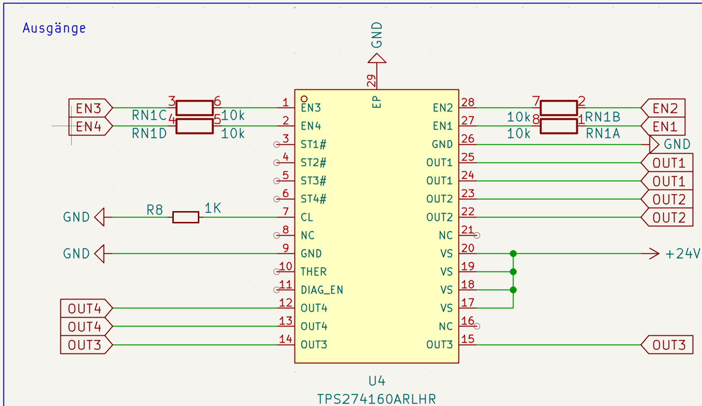

In my last post [Attiny1616, PlatformIO and UPDI](https://blog.bouni.de/posts/2024/attiny1616-platformio-and-updi/) I descriped how I use UPDI to programm an Attiny1616 using [platformio](https://platformio.org/).

Since then a few things happened and I thought its a good chance to write up my improvements.

## UPDI circuit

I realized that it would come in handy if I could program my boards with no 24VDC supply connected to the borad, just the 5V from USB.
So I put in a diode in order to supply the 5V from USB to the uC.


## Writing fuses

I use [Adafruit's NeoPixel library](https://registry.platformio.org/libraries/adafruit/Adafruit%20NeoPixel) which works great. 
But it has a [check](https://github.com/adafruit/Adafruit_NeoPixel/blob/master/Adafruit_NeoPixel.cpp#L1836) that prevents it from running above 19Mhz.
The Attiny1616 runs at 20Mhz by default.

So I had a hard time figuring out how to set the correct fuse that switches the internal oscillator to 16Mhz.
The fuse responsible is `fuse2/osccfg` which needs to be set to `0x01` in order to run the CPU at 16Mhz.

I finally figured out that [avrdude](https://github.com/avrdudes/avrdude) is the only way that worked for me to write the fuse.

My platformio.ini now looks like this:

```ini
[env]
platform = atmelmegaavr
board = ATtiny1616
framework = arduino
board_build.f_cpu = 16000000L
monitor_speed = 115200
lib_deps = hideakitai/Debouncer@^0.3.2
    adafruit/Adafruit NeoPixel@^1.12.4

[env:updi]
; t1616 = ATtiny1616
; fuse2 -> 0x01 = 16Mhz (0x02 = 20Mhz)
upload_command = avrdude -c serialupdi -p t1616 -P $UPLOAD_PORT -b $UPLOAD_SPEED -U fuse2:w:0x01:m -U flash:w:$SOURCE:i
```

A simple `pio run -t upload` sets the fuses and writes the firmware to the Attiny.

## Power supply and outputs

In my last project I used some really nice ICs for the first time with wich I'm really happy.

### Power supply

I almost always supply my boards with 24VDC, so I need a DC-DC converter that can handle this input voltage.
Also I hate it when I need a ton of additional parts, such as inductors, capacitors and so on that need to be calculated in order to work properly.
Ideally its a self contained module or IC. I know there are modules from Recom for example, but they are quite large and expensive.

So on my search for something better, I stumbled up on the [TI TPSM84209RKHT](https://www.ti.com/product/en-us/TPSM84209/part-details/TPSM84209RKHT)


Its a 4.5-V to 28-V input, 1.2-V to 6-V output, 2.5-A power module in a 4.5-mm × 4-mm × 2-mm QFN Package that needs only a few cpacitors and resistors as additional components.


combined with a polyfuse and a FET for reverse polarity protection, this is going to be my go to solution for the future!


And finally, [JLCPCB](https://jlcpcb.com/parts/componentSearch?searchTxt=C2836944) has this part in stock for 4USD!

### Outputs 

In the past I often used FETs for driving higher loads, but this has its own disadvantages.

I found the [TI TPS274160ARLHR](https://www.ti.com/product/en-us/TPS274160/part-details/TPS274160ARLHR) which 4-channel high-side switch.


To be more precise its a 36-V, 160-mΩ, 1.35-A, 4-ch, Industrial high-side switch with adjustable current limit.

It comes in a `QFN28` package and needs no additional components appart from 10k resistors in front of the enable inputs and a reistor for the current limit.



Its available at [JLCPCB](https://jlcpcb.com/parts/componentSearch?searchTxt=C2873565) for just 2.5USD
