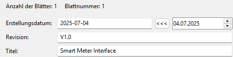
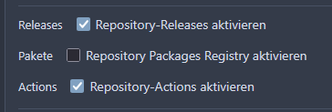
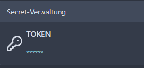
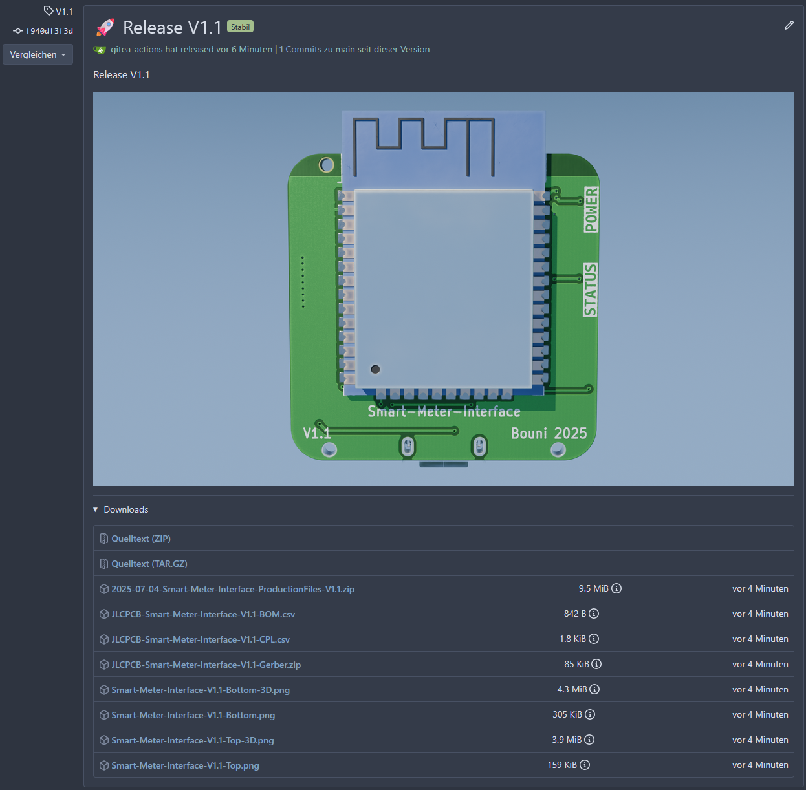
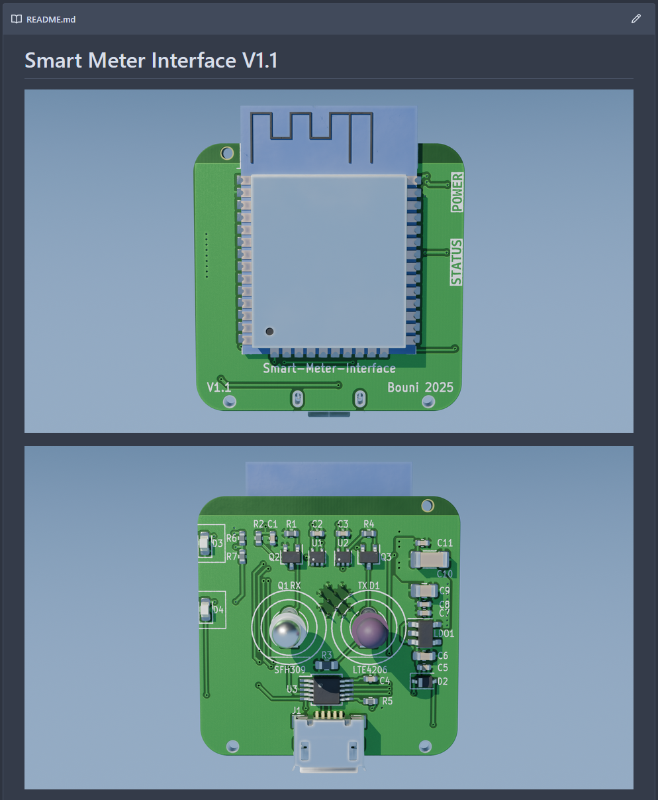

[KiCAD](https://www.kicad.org) is my favourite PCB design program. I use it for Hobby projects as well as in my day job.
I even wrote a rather successful plugin called [kicad-jlcpcb-tools](https://github.com/Bouni/kicad-jlcpcb-tools) for it that lets the user select parts from the [JLCPCB](https://jlcpcb.com/parts) catalog and assign them to the footprints.
Furthermore it generates the fabrication data consisting of a zip with all Gerber files and the Excellon drill file as well as a BOM CSV file and a CPL CSV file.
These three files can be uploaded to JLCPCBs website to get an instant quote for the PCB including assembly.

I'm quite happy with this plugin but lately I don't have enough spare time to keep up with all the upcoming issues and feature requests.
What also bothers me is the fact that JLCPCB is a Chinese company. The do great work and deliver PCBs very fast, but especially for my day job, I need a reliable source for the PCBs.
With the fast changing political things that happen around the world nowadays, I don't feel comfortable that my company is reliant on a supplier from China.
Also I want to strengthen European companies (I'm aware that still a considerable portion is still coming from China).

One more thin is that I use git to track my changes to the PCB projects. Wouldn't it be awesome if we could create fabrication data automatically?

A few weeks ago, I heard a talk at [Cosin](https://pretalx.chaostreff.ch/cosin-2025/talk/LB3LHN/) by [@seto](https://pretalx.chaostreff.ch/cosin-2025/speaker/F9UR8R/).
He showed how he uses the fairly new CLI of KiCAD to automate his PCB fabrication data generation.

I tried this in the past but never had it to a point where I could use it reliably, also I used [KiBot](https://kibot.readthedocs.io/en/master/) for this instead of "just" the CLI. 
KiBot is an amazing project with a ton of features.
It lets you generate various outputs from the project files such as schematics as PDF, BOM files as CSV, Gerber and Excellon files, images and 3D renderings and many more.

So I thought I might give this another try and came up with a fairly elegant solution, at least for what I need.

## Project setup

**Disclaimer: I use Gitea at the moment, but switching to Forgejo is on my ToDo list 😅**

The following things should work with Gitea, Forgejo and Github and possibly more but I've just tested Gitea so far.

### metadata.env

In my project I create a `metadata.env` file that looks like this:

```env 
LONG_NAME=Smart-Meter-Interface
SHORT_NAME=SMI
VERSION=V1.0
AUTHOR=Bouni
KIBOT_CONFIG=.kibot/kibot-double-sided.yaml
PCB_FILE=hardware/smart-meter-interface.kicad_pcb
SCH_FILE=hardware/smart-meter-interface.kicad_sch
```

 - `LONG_NAME` is the full name of the project
 - `SHORT_NAME` is a short abbreviation 
 - `VERSION` is the version of the project
 - `KIBOT_CONFIG` is either `-double-` or `-single-` depending if your project needs images of both sides.
 - `PCB_FILE` is the relative path to the `.kicad_pcb` file
 - `SCH_FILE` is the relative path to the `.kicad_sch` file

### kibot configs

In a subfolder called `.kibot` I have two KiBot configs, one for single sided projects called `kibot-single-sided.yaml` and one for double sided projects called `kibot-double-sided.yaml`

I show the double sided version as the single sided one has just a few outputs less, apart from that they are identical

```yaml
---
kibot:
  version: 1

global:
  output: "@LONG_NAME@-%r-%i.%x"
  field_lcsc_part: LCSC  # this specifies the field name in which the LCSC number of a component is stored, for example C12345

import:  # With this we import the template that generates all production files for JLCPCB
  - file: JLCPCB
    definitions:
      _KIBOT_POS_ONLY_SMD: false  # by default all THT components are omited, but I want to have them assembled as well

outputs:

  - name: 'Gerber'  # gerber files for my European manufacturer
    comment: 'Gerber files'
    type: 'gerber'
    dir: 'gerber'
    layers:
      - "F.Cu"
      - "B.Cu"
      - "F.Mask"
      - "B.Mask"
      - "F.Silkscreen"
      - "B.Silkscreen"
      - "Edge.Cuts"
    options:
      output: "@LONG_NAME@-%r-Gerber-%i.%x"

  - name: 'Excellon'  # excellon files for my European manufacturer
    comment: 'Excellon drill files'
    type: 'excellon'
    dir: 'excellon'
    options:
      output: "@LONG_NAME@-%r-Drill.%x"

  - name: 'Pick and Place'  # Pick n Place files for my European manufacturer
    comment: "Pick and Place file"
    type: 'position'
    dir: 'pick-and-place'
    options:
      output: "@LONG_NAME@-%r-PickAndPlace.%x"
      format: "CSV"
      separate_files_for_front_and_back: false

  - name: 'BOM'  # Bill of material for my European manufacturer
    comment: "Bill of materials (XLSX)"
    type: bom
    options:
      output: "@LONG_NAME@-%r-Stückliste.%x"
      format: "XLSX"
      columns:
        - "Row"
        - "References"
        - "Value"
        - "Footprint"
        - "Quantity per PCB"
        - "MPN"
        - "Manufacturer_Name"
      normalize_values: true
      xlsx:
        logo: false
        title: "Stückliste @LONG_NAME@ %r"
        hide_pcb_info: true
        hide_stats_info: true
highlight_empty: false

  - name: 'Schematic'  # schematic for my European manufacturer
    comment: "Print schematic (PDF)"
    type: pdf_sch_print
    options:
      output: "@LONG_NAME@-%r-Schema.%x"

  - name: 'PCB TOP image'  # top image of the PCB without components for my European manufacturer
    comment: "PNG of the top side of the PCB"
    type: pcbdraw
    options:
      output: "@LONG_NAME@-%r-Top.%x"
      dpi: 1200
      format: png

  - name: 'PCB BOTTOM image'  # bottom image of the PCB without components for my European manufacturer
    comment: "PNG of the bottom side of the PCB"
    type: pcbdraw
    options:
      output: "@LONG_NAME@-%r-Bottom.%x"
      dpi: 1200
      format: png
      bottom: true

  - name: "3D Blender top image"  # 3D rendered image of the top for the README
    comment: "@LONG_NAME@ 3D render from top (High Quality)"
    type: blender_export
    options:
      render_options:
        background1: "#8FBCF7FF"
        background2: "#0B1E35FF"  
        samples: 20
        resolution_y: 1440
        resolution_x: 2560
      point_of_view:
        rotate_x: -5
      outputs:
        - type: render
          output: "@LONG_NAME@-%r-Top-3D.png"

  - name: "3D Blender bootom image"  # 3D rendered image of the bottom for the README
    comment: "@LONG_NAME@ 3D render from bottom (High Quality)"
    type: blender_export
    options:
      render_options:
        background1: "#8FBCF7FF"
        background2: "#0B1E35FF"  
        samples: 20
        resolution_y: 1440
        resolution_x: 2560
      point_of_view:
        rotate_x: 5
        rotate_y: 180
      outputs:
        - type: render
          output: "@LONG_NAME@-%r-Bottom-3D.png"

```

### Gitea action

Note: this can be a Github action or a Forgejo action as well, that just requires a changed folder name as far a s I can tell.

```yaml 
name: Auto Release
run-name: Auto Release Gestartet von ${{ gitea.actor }} 🚀
on:
  push:
    branches: [main]
    paths: [metadata.env]
```
This part controls when the action should run, I decided to only run it if I change the metadata.env, usually the only thing that changes is the version.

```yaml
env:
  BASE_URL: https://gitea.bouni.de
```
Here I set the base URL of my gitea instance, maybe there is a smarter way to achieve this but it works 🤷‍♂️


```
jobs:
  release:
    runs-on: ubuntu-latest
    outputs:
      RELEASE_ID: ${{ steps.create_release.outputs.RELEASE_ID }}
```
This part is important, we need to pass the release id from one job to the other. For whatever reason the Gitea API uses a release id for the upload of files rather than the release tag 🙄


```yaml
    steps:
      - name: Checkout code
        uses: actions/checkout@v3
        with:
          token: ${{ secrets.GITEA_TOKEN }}
          fetch-depth: 0 # Needed for tagging
      - name: Load metadata from metadata.env file
        id: metadata
        run: |
          set -a
          source metadata.env
          set +a
          echo "LONG_NAME=$LONG_NAME" >> $GITHUB_OUTPUT
          echo "SHORT_NAME=$SHORT_NAME" >> $GITHUB_OUTPUT
          echo "VERSION=$VERSION" >> $GITHUB_OUTPUT
          echo "AUTHOR=$AUTHOR" >> $GITHUB_OUTPUT
```
Checkout the repo, read the metadata.env into env vars and write the ones we need into $GITHUB_OUTPUT


```yaml
      - name: Install jq
        id: install_jq
        run: |
          if ! command -v jq &> /dev/null; then
            apt-get update && apt-get install -y jq
          fi
```
Install [jq](https://jqlang.org/), we need that later to parse JSON data

```yaml
      - name: Detect release type
        id: version
        run: |
          # Check if it's a pre-release (contains RC, alpha, beta, dev, etc.)
          if [[ "${{ steps.metadata.outputs.VERSION }}" =~ -RC[0-9]*$ ]] || \
             [[ "${{ steps.metadata.outputs.VERSION }}" =~ -alpha[0-9]*$ ]] || \
             [[ "${{ steps.metadata.outputs.VERSION }}" =~ -beta[0-9]*$ ]] || \
             [[ "${{ steps.metadata.outputs.VERSION }}" =~ -dev[0-9]*$ ]] || \
             [[ "${{ steps.metadata.outputs.VERSION }}" =~ -pre[0-9]*$ ]]; then
            echo "PRERELEASE=true" >> $GITHUB_OUTPUT
            echo "Detected PRE-RELEASE: ${{ steps.metadata.outputs.VERSION }}"
          else
            echo "PRERELEASE=false" >> $GITHUB_OUTPUT
            echo "Detected STABLE RELEASE: ${{ steps.metadata.outputs.VERSION }}"
          fi
      - name: Check if tag exists
        id: check_tag
        run: |
          if git rev-parse "${{ steps.metadata.outputs.VERSION }}" >/dev/null 2>&1; then
            echo "exists=true" >> $GITHUB_OUTPUT
            echo "Tag ${{ steps.metadata.outputs.VERSION  }} already exists!"
            exit 1
          else
            echo "exists=false" >> $GITHUB_OUTPUT
          fi
```
Check if we have a Pre-Release and set a variable if so, then verify that this release does not exist. If it exists, we exit the action.


```yaml
      - name: Update README
        if: steps.check_tag.outputs.exists == 'false'
        run: |
          # Replace version in README
          sed -i -E 's|V[0-9]+\.[0-9]+(-RC[0-9]+)?|${{ steps.metadata.outputs.VERSION  }}|g' README.md

          # Delete pre-release warning
          sed -i '/This is a pre-release version/d' README.md

          # Add pre-release badge if it's a pre-release
          if [[ "${{ steps.version.outputs.PRERELEASE }}" == "true" ]]; then
            # Add pre-release warning to README
            sed -i '1i\> **⚠️ This is a pre-release version. Use with caution!**' README.md
          fi
```
Update the Versions in the README and add a pre-release warning at the top if it is a pre-release.


```yaml
      - name: Commit README changes
        if: steps.check_tag.outputs.exists == 'false'
        run: |
          git config --local user.email "action@gitea.local"
          git config --local user.name "Gitea Action Bot"
          git add README.md
          if [[ "${{ steps.version.outputs.PRERELEASE }}" == "true" ]]; then
            git commit -m "Update README for pre-release ${{ steps.metadata.outputs.VERSION  }}" || echo "No changes to commit"
          else
            git commit -m "Update README for release ${{ steps.metadata.outputs.VERSION  }}" || echo "No changes to commit"
          fi
```
Commit the README

```yaml
      - name: Create tag
        if: steps.check_tag.outputs.exists == 'false'
        run: |
          git tag "${{ steps.metadata.outputs.VERSION  }}"
          git push origin main
          git push origin "${{ steps.metadata.outputs.VERSION  }}"
      - name: Create release
        id: create_release
        if: steps.check_tag.outputs.exists == 'false'
        run: |
          if [[ "${{ steps.version.outputs.PRERELEASE }}" == "true" ]]; then
            RELEASE_NAME="🚧 Pre-release ${{ steps.metadata.outputs.VERSION }}"
            RELEASE_BODY="Pre-release ${{ steps.metadata.outputs.VERSION }} - This is a pre-release version. \
            It may contain bugs and is not recommended for production use. Use with caution!\n\n\n \
            "
          else
            RELEASE_NAME="🚀 Release ${{ steps.metadata.outputs.VERSION }}"
            RELEASE_BODY="Release ${{ steps.metadata.outputs.VERSION }}\n\n\n \
            "
          fi

          # Simple JSON without complex escaping
          RESPONSE=$(curl -X POST \
            -H "Authorization: token ${{ secrets.GITEA_TOKEN }}" \
            -H "Content-Type: application/json" \
            -d "{\"tag_name\":\"${{ steps.metadata.outputs.VERSION }}\",\"name\":\"$RELEASE_NAME\",\"body\":\"$RELEASE_BODY\",\"draft\":false,\"prerelease\":${{ steps.version.outputs.PRERELEASE }}}" \
            "${{ gitea.api_url }}/repos/${{ gitea.repository }}/releases")

          # Extract release ID and upload URL
          RELEASE_ID=$(echo "$RESPONSE" | jq -r '.id')
          echo "RELEASE_ID=$RELEASE_ID" >> $GITHUB_OUTPUT

          echo "Release created with ID: $RELEASE_ID"
      - name: Release summary
        id: release_summary
        if: steps.check_tag.outputs.exists == 'false'
        run: |
          if [[ "${{ steps.version.outputs.PRERELEASE }}" == "true" ]]; then
            echo "✅ Pre-release ${{ steps.metadata.outputs.VERSION  }} created successfully!"
          else
            echo "🎉 Stable release ${{ steps.metadata.outputs.VERSION  }} created successfully!"
          fi
```
Create a tag, create a release (with a path to a not yet existing 3D rendered image of the board) and finally print a success message

Now we enter the second job where we generate the production files and images.
```yaml
  production-file-export:
    name: Export Production files
    needs: release
    runs-on: ubuntu-latest
```
This needs the release job to have succeeded in order to run

```yaml
    steps:
      - name: Checkout Repository
        uses: actions/checkout@v4
        with:
          fetch-depth: 0
      - name: Install zip
        run: |
          apt-get update && apt-get install -y zip
```
Checkout the repo and install zip, we need that later.

```yaml
      - name: Load metadata from metadata.env file
        id: metadata
        run: |
          set -a
          source metadata.env
          set +a
          echo "DATE=$(date +%Y-%m-%d)" >> $GITHUB_OUTPUT
          echo "YEAR=$(date +%Y)" >> $GITHUB_OUTPUT
          echo "LONG_NAME=$LONG_NAME" >> $GITHUB_OUTPUT
          echo "SHORT_NAME=$SHORT_NAME" >> $GITHUB_OUTPUT
          echo "VERSION=$VERSION" >> $GITHUB_OUTPUT
          echo "AUTHOR=$AUTHOR" >> $GITHUB_OUTPUT
          echo "KIBOT_CONFIG=$KIBOT_CONFIG" >> $GITHUB_OUTPUT
          echo "PCB_FILE=$PCB_FILE" >> $GITHUB_OUTPUT
          echo "SCH_FILE=$SCH_FILE" >> $GITHUB_OUTPUT
```
Again read the metadata.env and store the values into $GITHUB_OUTPUT

```yaml
      - name: Update Files with correct Version and Date
        run: |
          sed -i "s/(rev \"[^\"]*\")/(rev \"${{ steps.metadata.outputs.VERSION }}\")/" ${{ steps.metadata.outputs.PCB_FILE}}
          sed -i "s/(date \"[^\"]*\")/(date \"${{ steps.metadata.outputs.DATE }}\")/" ${{ steps.metadata.outputs.PCB_FILE}}
          sed -i "s/<[vV]>/${{ steps.metadata.outputs.VERSION }}/g" ${{ steps.metadata.outputs.PCB_FILE}}
          sed -i "s/<[yY]>/${{ steps.metadata.outputs.YEAR }}/g" ${{ steps.metadata.outputs.PCB_FILE}}
          sed -i "s/<[aA]>/${{ steps.metadata.outputs.AUTHOR }}/g" ${{ steps.metadata.outputs.PCB_FILE}}
          sed -i "s/<[sS]>/${{ steps.metadata.outputs.SHORT_NAME }}/g" ${{ steps.metadata.outputs.PCB_FILE}}
          sed -i "s/(rev \"[^\"]*\")/(rev \"${{ steps.metadata.outputs.VERSION }}\")/" ${{ steps.metadata.outputs.SCH_FILE}}
          sed -i "s/(date \"[^\"]*\")/(date \"${{ steps.metadata.outputs.DATE }}\")/" ${{ steps.metadata.outputs.SCH_FILE}}
```
Here we replace placeholders in the `kicad_pcb` file, `<V>` is replaced with the Version, `<Y>` is replaced with the current Year, `<A>` is replaced with the Author, `<S>` is replaced with the short name.
We also update Version and date of the PCB and schematic so that the exported schematic hast the correct version in the frame.


```yaml
      - name: Run KiBot for Teltronik Production files
        uses: INTI-CMNB/KiBot@v2_k9
        with:
          config: ${{ steps.metadata.outputs.KIBOT_CONFIG }}
          dir: ./output
          schema: ${{ steps.metadata.outputs.SCH_FILE}}
          board: ${{ steps.metadata.outputs.PCB_FILE}}
          additional_args: -E LONG_NAME=${{ steps.metadata.outputs.LONG_NAME }}
```
Now we run KiBot with the config, pcb file and schematic file specified in the metadata.env. We also pass the long name as an extta arg.


```yaml
      - name: Zip results
        id: zip
        run: |
          cd output
          zip -r ../${{ steps.metadata.outputs.DATE }}-${{ steps.metadata.outputs.LONG_NAME }}-ProductionFiles-${{ steps.metadata.outputs.VERSION }}.zip . -x  "JLCPCB/*" 
          cd ..
          echo "PRODUCTION_FILES=${{ steps.metadata.outputs.DATE }}-${{ steps.metadata.outputs.LONG_NAME }}-ProductionFiles-${{ steps.metadata.outputs.VERSION }}.zip" >> $GITHUB_OUTPUT
          echo "JLCPCB_GERBER_FILES=$(find output/JLCPCB -maxdepth 1 -iname "*.zip" -type f)" >> $GITHUB_OUTPUT
          echo "JLCPCB_BOM_FILE=$(find output/JLCPCB -maxdepth 1 -iname "*bom*" -type f)" >> $GITHUB_OUTPUT
          echo "JLCPCB_CPL_FILE=$(find output/JLCPCB -maxdepth 1 -iname "*cpl*" -type f)" >> $GITHUB_OUTPUT
```
Finally we zip the generated files, except the JLCPCB files because these are not meant for the European manufacturer.
The path to the resulting zip is again stored in a variable for later use.
The JLCPCB file (zip with gerbers/excellon, BOM and CPL) are also stored in separate variables.

```yaml
      - name: Upload Release artifacts
        env:
          KIBOT_CONFIG: ${{ steps.metadata.outputs.KIBOT_CONFIG }}
        run: |
          curl -v -X POST \
            -H "Authorization: token ${{ secrets.TOKEN }}" \
            -H "Content-Type: application/octet-stream" \
            -T ./output/${{ steps.metadata.outputs.LONG_NAME }}-${{ steps.metadata.outputs.VERSION }}-Top.png \
            "${{ gitea.api_url }}/repos/${{ gitea.repository }}/releases/${{ needs.release.outputs.RELEASE_ID }}/assets?name=${{ steps.metadata.outputs.LONG_NAME }}-${{ steps.metadata.outputs.VERSION }}-Top.png"
          curl -v -X POST \
            -H "Authorization: token ${{ secrets.TOKEN }}" \
            -H "Content-Type: application/octet-stream" \
            -T ./output/${{ steps.metadata.outputs.LONG_NAME }}-${{ steps.metadata.outputs.VERSION }}-Top-3D.png \
            "${{ gitea.api_url }}/repos/${{ gitea.repository }}/releases/${{ needs.release.outputs.RELEASE_ID }}/assets?name=${{ steps.metadata.outputs.LONG_NAME }}-${{ steps.metadata.outputs.VERSION }}-Top-3D.png"
          if [[ "${KIBOT_CONFIG}" == *"double"* ]]; then
            curl -v -X POST \
              -H "Authorization: token ${{ secrets.TOKEN }}" \
              -H "Content-Type: application/octet-stream" \
              -T ./output/${{ steps.metadata.outputs.LONG_NAME }}-${{ steps.metadata.outputs.VERSION }}-Bottom.png \
              "${{ gitea.api_url }}/repos/${{ gitea.repository }}/releases/${{ needs.release.outputs.RELEASE_ID }}/assets?name=${{ steps.metadata.outputs.LONG_NAME }}-${{ steps.metadata.outputs.VERSION }}-Bottom.png"
            curl -v -X POST \
              -H "Authorization: token ${{ secrets.TOKEN }}" \
              -H "Content-Type: application/octet-stream" \
              -T ./output/${{ steps.metadata.outputs.LONG_NAME }}-${{ steps.metadata.outputs.VERSION }}-Bottom-3D.png \
              "${{ gitea.api_url }}/repos/${{ gitea.repository }}/releases/${{ needs.release.outputs.RELEASE_ID }}/assets?name=${{ steps.metadata.outputs.LONG_NAME }}-${{ steps.metadata.outputs.VERSION }}-Bottom-3D.png"
          fi
          curl -v -X POST \
            -H "Authorization: token ${{ secrets.TOKEN }}" \
            -H "Content-Type: application/octet-stream" \
            -T ${{ steps.zip.outputs.PRODUCTION_FILES }} \
            "${{ gitea.api_url }}/repos/${{ gitea.repository }}/releases/${{ needs.release.outputs.RELEASE_ID }}/assets?name=${{ steps.zip.outputs.PRODUCTION_FILES }}"
          curl -v -X POST \
            -H "Authorization: token ${{ secrets.TOKEN }}" \
            -H "Content-Type: application/octet-stream" \
            -T ${{ steps.zip.outputs.JLCPCB_GERBER_FILES }} \
            "${{ gitea.api_url }}/repos/${{ gitea.repository }}/releases/${{ needs.release.outputs.RELEASE_ID }}/assets?name=JLCPCB-${{ steps.metadata.outputs.LONG_NAME }}-${{ steps.metadata.outputs.VERSION }}-Gerber.zip"
          curl -v -X POST \
            -H "Authorization: token ${{ secrets.TOKEN }}" \
            -H "Content-Type: application/octet-stream" \
            -T ${{ steps.zip.outputs.JLCPCB_BOM_FILE }} \
            "${{ gitea.api_url }}/repos/${{ gitea.repository }}/releases/${{ needs.release.outputs.RELEASE_ID }}/assets?name=JLCPCB-${{ steps.metadata.outputs.LONG_NAME }}-${{ steps.metadata.outputs.VERSION }}-BOM.csv"
          curl -v -X POST \
            -H "Authorization: token ${{ secrets.TOKEN }}" \
            -H "Content-Type: application/octet-stream" \
            -T ${{ steps.zip.outputs.JLCPCB_CPL_FILE }} \
            "${{ gitea.api_url }}/repos/${{ gitea.repository }}/releases/${{ needs.release.outputs.RELEASE_ID }}/assets?name=JLCPCB-${{ steps.metadata.outputs.LONG_NAME }}-${{ steps.metadata.outputs.VERSION }}-CPL.csv"

```
Finally we upload the files as release artifacts. If the string "double" occurs in the kibot config we upload Bottom files as well.

### Readme.md

In the Readme.md I always add the name of the project on top, followed by the version, for example `# Smart-Merter-Interface V1.0`.
The Version will be automatically replaced by the action, so it doesn't matter what exact version we put in here as long as its in the right format.

I also put two links to the front and if double sided, bottom pictures

```md 


```

The versions in these URLs are also replaced by the action

### Page settings

Another important step is to ensure that in the page settings of both, schematic and pcb the date, the version and the description are filled in.



### Important settings

Before we push the files to the Gitea instance, we need to prepare the repo.

First we need to enable Releases and Actions



Next we must add an action secret named `TOKEN`



The token mus have the following permissions

 - write:package
 - write:repository

A token can be generated under your user settings -> Applications -> Access Tokens

### The result

When everything goes according to plan, we end up with a release that has a 3D rendered picture of the Top side of the PCB in the description as well as several attached artifacts.



Also the README.md has nice renderings of the top and bottom now




