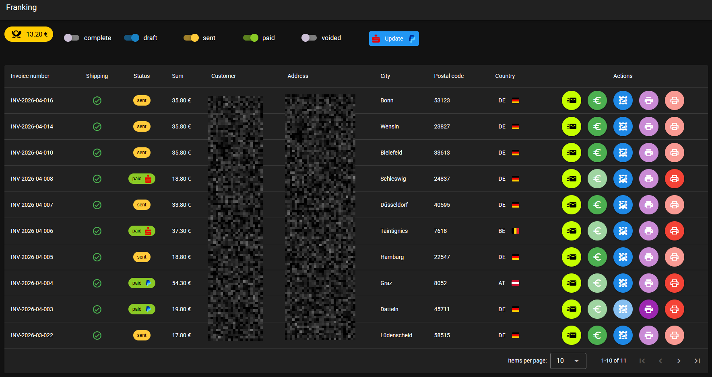

At the annual Chaos communication congress, in this specific case the [39C3](https://events.ccc.de/congress/2025/infos/startpage.html) a talk was given by [Hajo Noerenberg](https://github.com/hn) and [Severin von Wnuck-Lipinski](https://github.com/medusalix) called [hacking wasching machines](https://fahrplan.events.ccc.de/congress/2025/fahrplan/event/hacking-washing-machines).

In this talk Hajo showed how he made wasching machines among other home appliances manufactured by [B/S/H](https://en.wikipedia.org/wiki/BSH_Hausger%C3%A4te) smart, or to be more precise, integrate them into [Home-Assistant](https://www.home-assistant.io/).

It was the best talk I have seen in a long time and as an owner of at least two BSH appliances (washing machine and a dryer) I was immediately on fire to get this into my machines as well.
At the end of the talk Hajo said he could use help designing and manufacturing a custom PCB for this, as he only had a dev board setup.

I reached out and offered my help, which resulted in the [BSH-Board](https://github.com/Bouni/BSH-Board/).

But before I could start sending them out to other enthusiasts, I needed an invoicing solution, preferably self-hosted and free as I didn't plan on making money on these boards.

After a search I stumbled over [Invio](https://github.com/kittendevv/Invio), a brand new invoicing solution with just the basics, no clutter. Perfect 😎

A few years ago I already sold PCBs. Small 1-wire boards that can act as simple sensor interfaces and be read out from the [Loxone 1-wire extension](https://www.loxone.com/dede/kb/1-wire-extension/).

Back then I wrote my own invoicing solution, but I couldn't find what I botched together back then. The only thing I remembered as extremely helpful was the purchase of [Deutsche Post Internetmarken](https://www.deutschepost.de/de/i/internetmarke-porto-drucken.html) (a digital postage stamp) directly out of the UI and the direct printing via a [Brother QL-710W](https://store.brother.ch/de-ch/devices/label-printer/ql/ql700).

I asked [kittendevv](https://github.com/kittendevv) if he can integrate such a functionality directly into Invio. He said maybe in the future, but as I had BSH-Boards on their way, I had no time to waste and decided to build my own sidecar solution as a Invio extension.

Out of this came [franking](https://github.com/Bouni/franking/)

A hacky project that uses [FastAPI](https://fastapi.tiangolo.com/) as the backend and [vuetify](https://vuetifyjs.com/) for the frontend.
It also uses [python-inema](https://codeberg.org/gms/python-inema) for purchasing the Internetmarken and [brother_ql](https://github.com/pklaus/brother_ql) for printing the labels on the Brother QL 710W printer.

To make things even more convenient, I integrated the [PayPal API](https://developer.paypal.com/api/rest/) and [python-fints](https://github.com/raphaelm/python-fints) to fetch received payments, compare them to not yet paid invoices and mark them as paid if a match is found. The FinTS part was a bit challenging as banking regulations require each application that wants to interface with a bank to have its own Product ID. For thsi you have to apply for such an ID with the "[Die deutsche Kreditwirtschaft](https://www.fints.org/de/hersteller/produktregistrierung)" which I did. I didn't expect them to give me an ID as an individual, but after a couple of days, I received mine.

What franking now can do for me:

- Send invoices directly from the UI to the e-mail address in the user created in Invio
- Mark invoices as paid in Invio via its API, either automatically via PayPal and FinTS API or in case a customer didn't write the invoice number in their transaction, manually.
- Purchase a Internetmarke for a Grossbrief national or Grossbrief international using the address data from Invio, depending on the customers country code
- Printing the Internetmarke
- Printing the invoice on paper
- Marking the Invoice as complete once I packed an order 

This made the process more fun than I originally expected. I hope for more orders in the future to have an excuse to improving the system even further 😅
