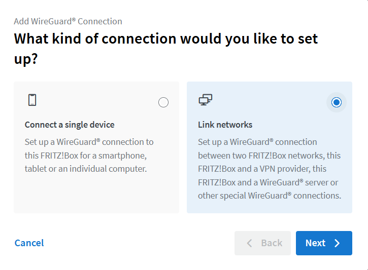
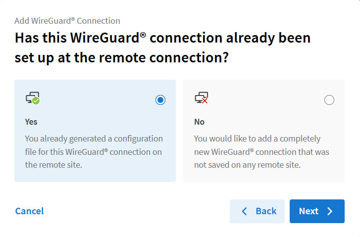
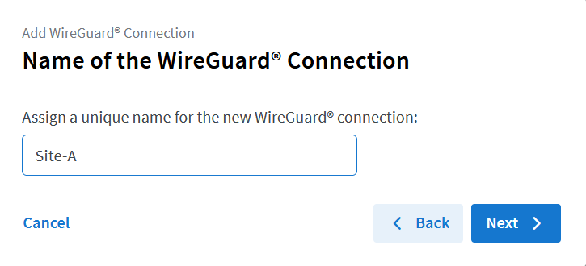
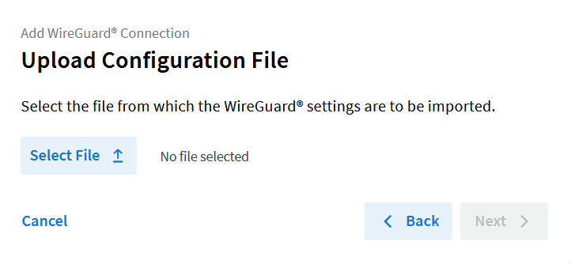
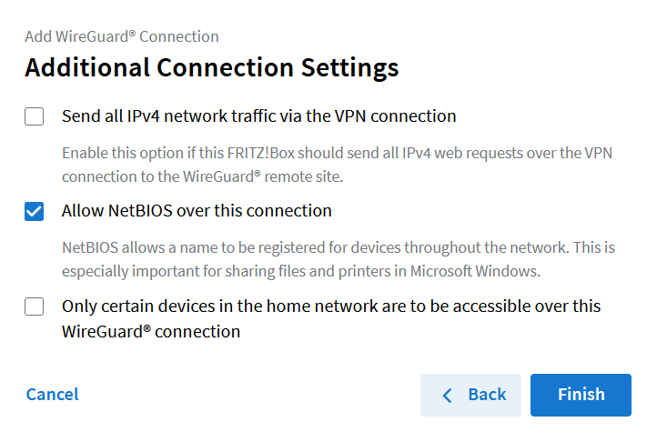
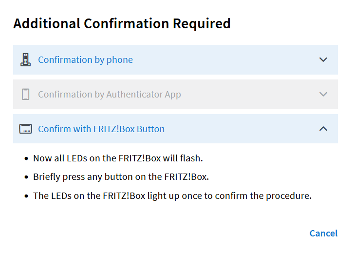

I tried for quite some time to get a reliable and safe Site-to-Site VPN between two locations but never figured it out completely.
Site A runs on a Mikrotik hAP ac as its router, Site B runs on a FRITZ!Box 7530 AX.
Since RouterOS v7 Wireguard is supported as an official VPN solution, for the Fritzbox Wireguard is supported since FRITZ!OS 7.50.
I wanted a real Site-to-Site VPN so that I can access devices on the other site from both sites.

Turns out that is not so easy to achieve as the Fritzbox is a bit weird and does not allow to modify config values after a config is uploaded.

I ended up setting up the Mikrotik router as the server and the Fritzbox as the client.

## Step 1 - Mikrotik public key

I start with adding a Wireguard interface on the Mikrotik

```sh 
/interface wireguard add name=fritzbox-wg listen-port=51820 comment="Wireguard Site-to-Site to FritzBox"
```

Now we need to get the public key of the Mikrotik

```sh 
/interface/wireguard/print

Flags: X - DISABLED; R - RUNNING
 0  R ;;; Wireguard Site-to-Site to FritzBox
      name="fritzbox-wg" mtu=1420 listen-port=51820 public-key="ZHbjLKhWCsFJwfaLwJFzYY+q4HC7HFlP7GVXfj2NKTk="
```

Here we see that the Mikrotiks public key is `ZHbjLKhWCsFJwfaLwJFzYY+q4HC7HFlP7GVXfj2NKTk=`


## Step 2 - Config file for the Fritzbox 

We create a config file and call it `fritzbox.conf` for example that looks like this:

```ini
[Interface]
PrivateKey = <fritzbox_private_key>
DNS = 192.168.88.1
 
[Peer]
PublicKey = <mikrotik_public_key>
PresharedKey = <psk>
AllowedIPs = 10.0.0.1/24, 192.168.88.0/24
Endpoint = <mikrotik_public_ip_or_dns>:<mikrotik_wireguard_port>
PersistentKeepalive = 25
```

We need to generate keys for the Fritzbox, therefore we run `wg genkey` on a linux machine and get something like `gMt66o631A3Z0nZYoCEHwSt2edA0mkbH6Q3lOfLVNFw=`.
If the `wg` command is not found you need to install `wireguard-tools`, at least thats what the package is called on Arch linux.
Next we need to generate the public key for the Fritzbox like this `echo "gMt66o631A3Z0nZYoCEHwSt2edA0mkbH6Q3lOfLVNFw=" | wg pubkey` and get `iX7yZ1SR1r8i2+DiUzh4hMDOVEGNHtX9bSluuGnRp0E=`.

Now we need to generate a pre-shared key with `wg genpsk`, that gives us `3LPRiA4G7Cjiov5oHCry+avYLmEwUtFsyRUIEYOVkv0=`.

With these two keys we can fill in the config file:

```ini
[Interface]
PrivateKey = gMt66o631A3Z0nZYoCEHwSt2edA0mkbH6Q3lOfLVNFw=
DNS = 192.168.88.1
 
[Peer]
PublicKey = ZHbjLKhWCsFJwfaLwJFzYY+q4HC7HFlP7GVXfj2NKTk=
PresharedKey = 3LPRiA4G7Cjiov5oHCry+avYLmEwUtFsyRUIEYOVkv0=
AllowedIPs = 10.0.0.0/24, 192.168.88.0/24
Endpoint = site-a.mytld.de:51820
PersistentKeepalive = 25
```

A few side notes, `192.168.88.1` is the IP of the Mikrotik Router, so I added this as DNS to the config file. With this the local DNS entries from the Mikrotik side resolve on the Fritzbox side.
`10.0.0.0/24` is the tunnel IP range, `192.168.88.0/24` is the IP range on the Mikrotik side. `site-a.mytld.de` is a DNS entry (or a dynDNS entry) pointing to the public IP of the Mikrotik router. `51820` is the Port we use, that must match what we used in Step 1 when we created the Wireguard interface.


The key to have routing between both sides is to not set an IP on the Interface (Address = 10.0.0.2 for example).
If the address is set the routing does not work.


## Step 3 - Mikrotik configuration

Now we add the Fritzbox as a peer

```sh
/interface wireguard peers add interface="fritzbox-wg" \
  public-key="iX7yZ1SR1r8i2+DiUzh4hMDOVEGNHtX9bSluuGnRp0E=" \
  preshared-key="3LPRiA4G7Cjiov5oHCry+avYLmEwUtFsyRUIEYOVkv0=" \
  allowed-address=10.0.0.0/24,192.168.178.0/24 \
  persistent-keepalive=25s \
  comment="FritzBox Site-B"
```

I assume that the Fritzbox IP range is `192.168.178.0/24`, `10.0.0.0/24` is the tunnel IP range.

Next we add a route to the Fritzbox LAN

```sh
/ip route add dst-address=192.168.178.0/24 \
  gateway="fritzbox-wg" comment="FritzBox Site-B LAN"
```

Now we add a few Firewall rules, first one for the traffic from the Mikrotik to the Fritzbox

```sh
/ip firewall filter add chain=forward action=accept \
  src-address=192.168.88.0/24 dst-address=192.168.178.0/24 \
  comment="VPN Forward to FritzBox Site-B" \
  place-before=0
```

And another one for the direction of the Fritzbox towards the Mikrotik

```sh
/ip firewall filter add \
  chain=forward action=accept \
  src-address=192.168.178.0/24 dst-address=192.168.88.0/24 \
  comment="VPN Forward from FritzBox Site-B" \
  place-before=0
```

## Step 4 - Upload config to the Fritzbox 

First go to `Internet > Permit Access > VPN (WireGuard®)` and click on `Add WireGuard® Connection`.

Select the options as shown in the following screenshots.









Here you select the config file that we created earlier



Allow NetBIOS over this connection is optional but I read that it is useful with Windows Clients



After that you should see that the indicator for the new Wireguard connection on the Fritzbox turns green after a few seconds.

## Disclaimer

I'm a novice when it comes to networking, Wireguard, routing and so on, so I'm more than happy that I got it working in the end.

If you find an error or have a suggestion for improvement, let me know!
